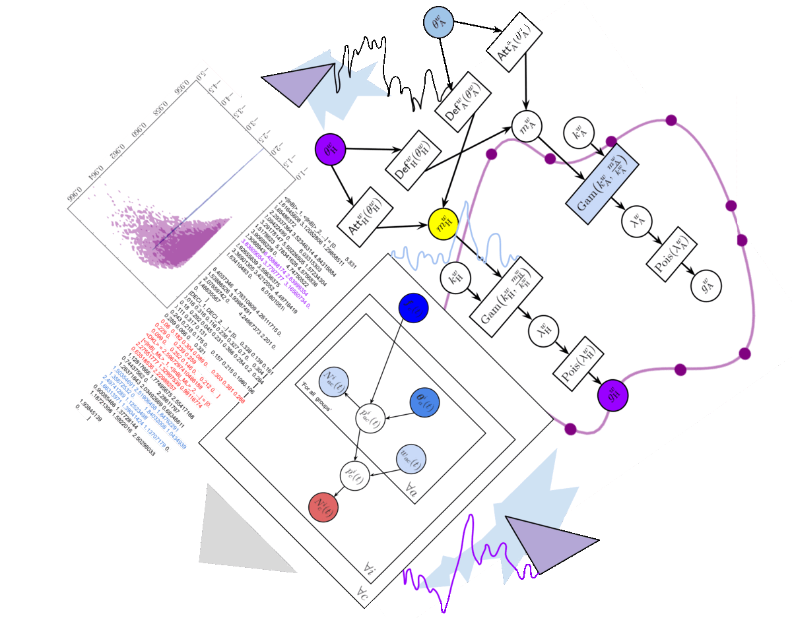

# So what is the 'stochadex'?

So what's the _big_ idea here? This is a generalised simulation engine that is able to generate samples from a  of possible stochastic processes that a researcher might encounter. A 'Pokédex' here is my fanciful take on a very general class of multidimensional stochastic processes that pop up everywhere in taming the mathematical wilds of real-world phenomena, and which also leads to a name for the software: the _stochadex_. With such a thing pre-built and self-contained, it can become the basis upon which to build generalised software solutions for a lot of different interesting problems - happy days!

The point here, from a software engineering perspective, is to design something which abstracts away many of the common features that sampling algorithms have for performing these computations behind an easier- (and hence faster) -to-use API. This isn't particularly new as a concept (see, e.g., [SimPy](https://gitlab.com/team-simpy/simpy/), [StoSpa](https://github.com/BartoszBartmanski/StoSpa), [FLAME GPU](https://github.com/FLAMEGPU/FLAMEGPU2/) and loads more), but the design challenge will provide both a mathematical formalism to reference in future projects, and, to be honest, writing the code has just been a lot of fun in [Go](https://go.dev/). 
