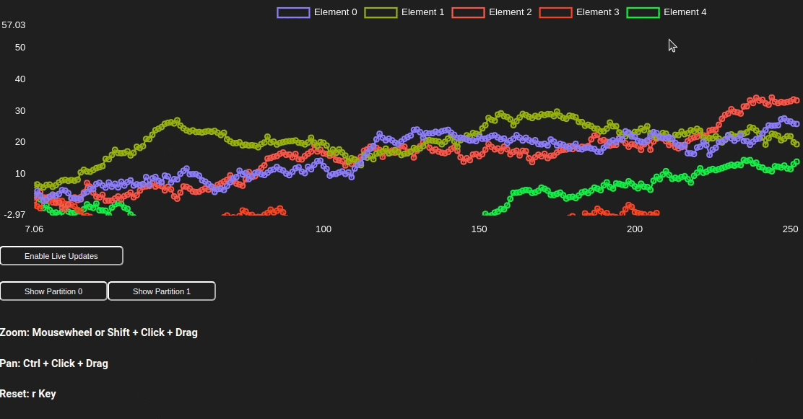

# So what is the 'stochadex'?

So what's the _big_ idea here? This is a generalised simulation engine that is able to generate samples from a 'Pokédex' of possible stochastic processes that a researcher might encounter. A 'Pokédex' here is just a fanciful description for a very general class of multidimensional stochastic processes that pop up everywhere in taming the mathematical wilds of real-world phenomena, and which also leads to a name for the software: the _stochadex_. With such a thing pre-built and self-contained, it can become the basis upon which to build generalised software solutions for a lot of different interesting problems - happy days!

The point, from a software engineering perspective, is to design something which abstracts away many of the common features that sampling algorithms have for performing these computations behind a highly-configurable interface. This isn't particularly new as a concept (see, e.g., [SimPy](https://gitlab.com/team-simpy/simpy/), [StoSpa](https://github.com/BartoszBartmanski/StoSpa), [FLAME GPU](https://github.com/FLAMEGPU/FLAMEGPU2/) and loads more), however the design provides a mathematical formalism to reference in future projects, and, to be honest, writing the code from scratch has just been a lot of fun in Go!

In addition to being a simulation engine for any stochastic phenomena that the developer can dream up; the stochadex has also been extended to include an 'interactions' package, which enables one to design agents that can observe and influence the phenomena in a generalised fashion. 

## Need more context and documentation?

The design, development, implementation details behind and practical documentation for the stochadex can all be found in **Part 1** and **Part 3** of this very delightful book: [Diffusing Ideas](https://umbralcalc.github.io/diffusing-ideas).

## Building and running the binary

```shell
# update the go modules
go mod tidy

# build the binary
go build -o bin/ ./cmd/stochadex

# run your configs with the dashboard off
./bin/stochadex --settings ./cfg/settings_config.yaml \
--implementations ./cfg/implementations_config.yaml
```

## Building and running the real-time dashboard

```shell
# install the dependencies of and build the app
cd ./app && npm install && npm run build && cd ..

# run the stochadex with a dashboard config and checkout http://localhost:3000
./bin/stochadex --settings ./cfg/settings_config.yaml \
--implementations ./cfg/implementations_config.yaml \
--dashboard ./cfg/dashboard_config.yaml
```



## Developing the code and real-time dashboard

You can add any new stochastic phenomena you like by following the patterns for other processes given in the `pkg/phenomena` package. The key step is to create a new struct for your process which implements the `simulator.Iteration` interface.

You can also design agents to interact with these phenomena by implementing the interfaces which can be found in the `pkg/interactions` package.

To develop the real-time dashboard, you can start the development server by running `cd ./app && npm start && cd ..` and view the code in the `app/` directory. The dashboard is a React app which is served by the stochadex via a websocket connection.
