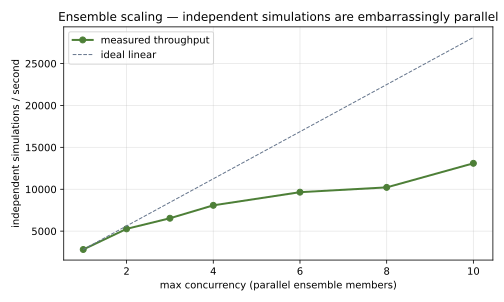
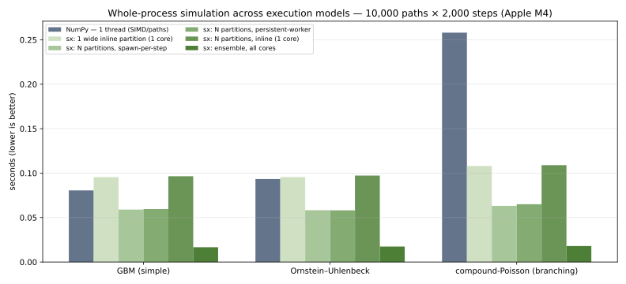
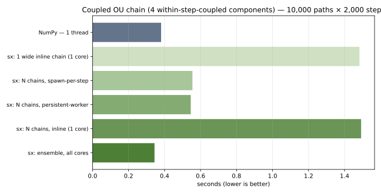
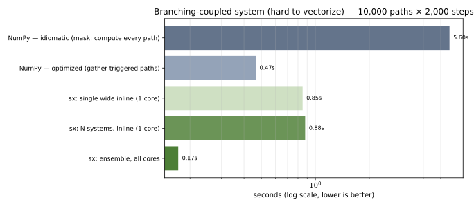
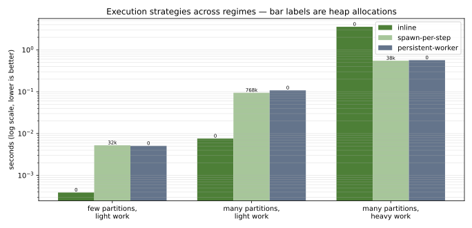
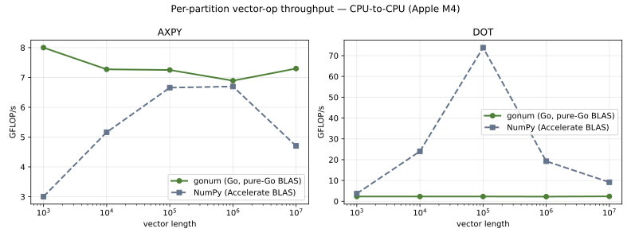

# Benchmarks

Fair, **CPU-to-CPU** measurements of the systems-performance claims that are actually
stochadex's. Deliberately **not** a peak-FLOPs race against GPU frameworks (JAX, Julia
SciML) — those win on their own hardware and problem shapes, and comparing them on a
laptop CPU would be apples-to-oranges. See [`WHEN_TO_USE.md`](../WHEN_TO_USE.md) for where
those tools are the right call.

## Reference machine

Numbers below were measured on **Apple M4 (10 cores: 4 performance + 6 efficiency),
macOS, Go 1.25, NumPy 2.4.3**. Benchmark numbers are machine-specific — reproduce on your
own hardware with the commands under [Reproducing](#reproducing). They are **not**
regenerated in CI: shared CI runners are not performance-stable, so committed numbers come
from this documented reference machine (CI only checks the benchmark still builds/runs).

## 1. Ensemble scaling — the parallelism claim

Independent simulations run as an **ensemble** (`simulator.RunSeededEnsemble`) are
embarrassingly parallel: there is no per-step barrier between members, so throughput
scales with `maxConcurrency` up to the core count.



| workers | 1 | 2 | 3 | 4 | 6 | 8 | 10 |
|---|---|---|---|---|---|---|---|
| sims/sec | 2758 | 5204 | 7623 | 8661 | 10491 | 11043 | 12241 |

~4.4× at 10 workers — near-linear across the **performance** cores, with diminishing
returns as the slower efficiency cores and memory bandwidth are added (a heterogeneous
Apple-silicon effect; on a homogeneous many-core server this curve is flatter and higher).

> **Important — this is the right place to measure concurrency.** Partitions *within one
> simulation* are step-synchronised (a barrier every step) for **coupled** components that
> exchange state each step. The within-sim strategies *do* parallelise those partitions
> (see §3, §"Execution strategies"), but the barrier caps the speedup below this barrier-free
> ensemble. **Decoupled, embarrassingly-parallel work is best run as an ensemble of separate
> simulations**, which is what this benchmark measures. Each member here is a single edge-free
> partition run under `InlineExecution` (no per-step goroutine spawn), with all parallelism at
> the ensemble level.

## 2. Cold start — warmup-free

Time from an unbuilt simulation to the first produced result (config assembly + first
step): **~2 µs**, stable run-to-run. A statically compiled Go binary has no interpreter or
JIT to warm up — the warmup-free, single-binary deployment property, stated as an absolute
rather than a rigged race against a JIT stack.

## 3. Whole-process simulation across execution models — the engine in the comparison

The most representative comparison: simulate the *same stochastic process* — 10,000 paths ×
2,000 steps — end to end, in NumPy (idiomatic: a step loop vectorized over paths, single
thread) and in stochadex across **every execution model it offers**. This puts the whole
engine (coordinator + `Iteration` + ensemble) in the loop, and makes explicit *which model
wins, why, and that you are free to tune it* — where NumPy gives you exactly one way to run.
Neither side stores history (fair timing of the simulation compute).



Wall-clock seconds (lower is better); **bold** = fastest per process:

| execution model | GBM (simple) | Ornstein–Uhlenbeck | compound-Poisson (branching) |
|---|---|---|---|
| NumPy — 1 thread, SIMD over paths | 0.081 | 0.093 | 0.258 |
| stochadex: 1 wide `Inline` partition (1 core) | 0.180 | 0.356 | 0.258 |
| stochadex: one sim, N partitions, `Inline` (1 core) | 0.182 | 0.361 | 0.258 |
| stochadex: one sim, N partitions, `SpawnPerStep` | 0.111 | 0.165 | 0.126 |
| stochadex: one sim, N partitions, `PersistentWorker` | 0.109 | 0.163 | 0.127 |
| stochadex: **ensemble, N `Inline` members, all cores** | **0.035** | **0.067** | **0.048** |

What the models teach — and why the freedom to choose matters:

- **The ensemble wins everything.** Independent paths are embarrassingly parallel; running
  them as an ensemble of separate simulations (no per-step barrier) uses every core and is
  fastest on all three — 2.3× / 1.4× / 5.4× faster than idiomatic NumPy.
- **Within one simulation, partition-parallelism does help — modestly.** Switching the
  strategy from `Inline` (serial) to `SpawnPerStep`/`PersistentWorker` parallelises the
  partitions within each step: GBM 0.182 → 0.11 s (~1.6×). But the per-step barrier caps it
  below the barrier-free ensemble. Lesson: for *independent* work the ensemble is the better
  parallel path; the within-sim strategies are for *coupled* work that needs the barrier.
  (See §"Execution strategies" for where each strategy wins outright.)
- **vs NumPy, it depends on the process.** On simple, trivially-vectorizable processes
  (GBM, OU) NumPy's SIMD over paths beats stochadex's *single-core* configs; stochadex wins by
  using cores. On the **branching** compound-Poisson, stochadex is already at parity
  single-threaded (0.258 s) and pulls ahead as soon as it uses cores (0.126 s within-sim,
  0.048 s ensemble) — masking + conditional draws are where vectorization loses.

Takeaway: the more complex or path-dependent the process, the better the engine looks — and
either way you have several execution models to tune, not one. Run *your* process.

### 3b. Coupled systems — linear coupling

The above simulate *independent* paths. Coupled systems — where components exchange state
within a step — are what the partition coordinator exists for. Here each unit is a chain of
**4 Ornstein–Uhlenbeck components**, where component *j* mean-reverts toward component *j−1*'s
current-step value (a within-step `ParamsFromUpstream` edge). The NumPy version must
hand-order the same cross-dependencies (the four updates cannot be fused).



| execution model | coupled chain (s) | vs NumPy |
|---|---|---|
| NumPy — 1 thread | 0.381 | — |
| stochadex: 1 wide inline chain (1 core) | 1.483 | 0.26× |
| stochadex: one sim, N chains, inline (1 core) | 1.492 | 0.26× |
| stochadex: one sim, N chains, spawn / persistent | ~0.55 | ~0.69× |
| stochadex: **ensemble, all cores** | **0.344** | **1.11×** |

**Honest result: ~parity.** On a *linearly*-coupled chain, NumPy vectorizes the coupling fine
(it is just sequential array reads), so stochadex's ensemble (0.344 s) only edges NumPy
(0.381 s). The engine parallelises the coupling well — the within-sim strategies take it from
1.49 s serial to ~0.55 s, and the ensemble to 0.344 s (**~4.3×** over serial) — but there is
no *vectorization* gap to exploit here, so it comes out level.

The honest reading: for a *linearly*-coupled system NumPy is a perfectly good tool and
stochadex's edge is expressiveness (declarative wiring), not raw speed. The speed advantage
appears when the coupling is **hard to vectorize** — next.

### 3c. Branching-coupled — hard to vectorize, where the engine wins

Now the coupling has a **per-path conditional**: an OU driver, and a responder that does
expensive work (a sum of 30 gamma draws) **only when the driver crosses a threshold** (~7%
of path-steps). This is what SIMD-over-paths cannot do cleanly — it must either compute the
expensive branch for *every* path and discard ~93%, or gather the few triggered paths with
non-obvious index juggling. A scalar per-path `if` just takes the branch.



| implementation | coupled system (s) |
|---|---|
| NumPy — idiomatic (mask: compute every path, select) | 5.598 |
| NumPy — optimized (gather only triggered paths) | 0.466 |
| stochadex — one sim, N systems, inline (1 core) | 0.877 |
| stochadex — one sim, N systems, spawn / persistent | 0.348 |
| stochadex — **ensemble, all cores** | **0.172** |

**This is where the engine leads.** stochadex is **~32× faster than idiomatic NumPy** (the
version most people would write — masking computes the expensive branch for every path and
discards ~93%). Against a *hand-optimized* gather/scatter NumPy (0.466 s), stochadex needs
its cores but still wins clearly — **2.7× as an ensemble, 1.3× with within-sim
parallelism** — because a scalar per-path branch has no wasted work and no gather overhead,
and the code is far simpler (a plain `if`). Single-threaded, the optimized NumPy (0.466 s)
does beat serial stochadex (0.877 s) — its gather *is* efficient on one thread — but that is
the version you have to know to write. And this is a *mild* branch — one rare condition, one
kind of expensive work; real coupled models (regime switches, thresholded dispatch, event
cascades, mutually-exciting processes) branch far more, widening the gap.

Together, 3b and 3c are the honest rule: **linearly-coupled → NumPy vectorizes it, ~parity;
conditionally/branching-coupled → the engine's per-path model wins outright**, and that is
where real decision-support models live.

## 4. Execution strategies — where each shines

stochadex lets you choose how a simulation runs its partitions each step. Which strategy
wins depends on the workload — here are three regimes, each won by a different one. Bar
labels (and the last column) are heap allocations during the run — GC pressure, which matters
for sustained work even when wall-clock ties.



| regime | `Inline` | `SpawnPerStep` | `PersistentWorker` |
|---|---|---|---|
| few partitions, light work, many steps | **~0.000 s / 0 allocs** | 0.006 s / 32k | 0.005 s / 0 |
| many partitions, light work, many steps | **0.008 s / 0** | 0.095 s / 769k | 0.106 s / 0 |
| many partitions, **heavy** work | 3.68 s / 0 | 0.55 s / 38k | **0.54 s / 0** |

- **`Inline` shines on light work** (few *or* many partitions): no goroutine/channel overhead
  per step — 0.008 s vs 0.095 s in the many-light regime — and it is allocation-free and
  deterministic. This is why ensemble members (single partitions) run inline.
- **`SpawnPerStep` / `PersistentWorker` shine on heavy per-step work with many partitions:**
  they parallelise the partitions across cores — ~6.7× over serial inline (0.54 s vs 3.68 s).
- **`PersistentWorker` matches `SpawnPerStep`'s speed with near-zero allocations** — it reuses
  a worker pool instead of spawning a goroutine per partition per step (769k → 0 allocs in the
  many-light regime). For sustained or GC-sensitive runs, that is the one to pick.

Rule of thumb: **light or single-partition → `Inline`; heavy multi-partition →
`PersistentWorker`** (or `SpawnPerStep` for simplicity); and for embarrassingly-parallel
independent work, an **ensemble** of inline members beats all of them.

## 5. Per-partition vector-op throughput vs NumPy — CPU-to-CPU parity (micro)

A supporting micro-benchmark: the raw elementwise/reduction ops (via gonum's pure-Go BLAS)
vs NumPy (Apple Accelerate BLAS). No engine involved — just confirming you don't give up
vectorized throughput at the primitive level by being in Go.



- **AXPY** (`y += a·x`, elementwise): gonum ~7–8 GFLOP/s vs NumPy ~3–6.7 GFLOP/s → **parity**.
- **DOT** (reduction): NumPy's Accelerate BLAS is faster on cache-resident sizes; gonum's
  default pure-Go BLAS trails. gonum can be linked against a C BLAS to close it if needed.

## Reproducing

From the repo root:

```bash
go run ./benchmarks                # Go: ensemble scaling, cold start, gonum ops, process models -> results/*.json
python3 benchmarks/numpy_processes.py   # NumPy whole-process comparison -> results/processes_numpy.json
python3 benchmarks/numpy_coupled.py        # NumPy coupled-chain comparison -> results/coupled_numpy.json
python3 benchmarks/numpy_branch_coupled.py # NumPy branching-coupled comparison -> results/branch_coupled_numpy.json
python3 benchmarks/numpy_ops.py            # NumPy vector-op micro-benchmark -> results/vectorized_ops_numpy.json
python3 benchmarks/plot.py              # render plots/*.svg from results/*.json
```

`results/*.json` and `plots/*.svg` are committed (measured on the reference machine above).
Re-running overwrites them with your machine's numbers.
