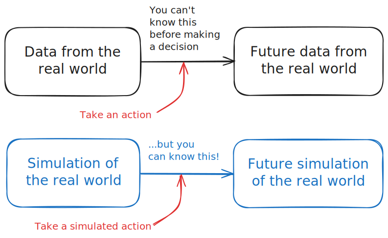

  

## So what is the 'stochadex' project?

It's a simulation engine written in Go which can be used to sample from, and learn computational models for, a whole 'Pokédex' of possible real-world systems.

For software engineers, the stochadex simulation framework abstracts away many of the common features that sampling algorithms have for performing these computations behind a highly-configurable interface.

While the concept of a 'generalised simulation engine' isn't new (see, e.g., [SimPy](https://gitlab.com/team-simpy/simpy/), [StoSpa](https://github.com/BartoszBartmanski/StoSpa), [FLAME GPU](https://github.com/FLAMEGPU/FLAMEGPU2/) and loads more), this simulation engine is designed based on deep research into [simulating a wide variety of real world systems over many years](https://github.com/umbralcalc) and has a structure which allows for a lot of cool applications.

## What can you do with this software?

One of the most compelling uses for simulation engines is to empower decision-making technologies.

In other words, if you want to answer questions like 'if I take this action, then what will happen in my system?', then it is often essential to build a simulation of your system and use this to simulate what might happen in the future.

The stochadex can be used to create these simulations and ensure that they behave in a way with closely matches the real data for the system that they are supposed to be modeling.

## Packages within the project

- [github.com/umbralcalc/stochadex/pkg/analysis](https://umbralcalc.github.io/stochadex/pkg/analysis.html)
- [github.com/umbralcalc/stochadex/pkg/api](https://umbralcalc.github.io/stochadex/pkg/api.html)
- [github.com/umbralcalc/stochadex/pkg/continuous](https://umbralcalc.github.io/stochadex/pkg/continuous.html)
- [github.com/umbralcalc/stochadex/pkg/discrete](https://umbralcalc.github.io/stochadex/pkg/discrete.html)
- [github.com/umbralcalc/stochadex/pkg/general](https://umbralcalc.github.io/stochadex/pkg/general.html)
- [github.com/umbralcalc/stochadex/pkg/inference](https://umbralcalc.github.io/stochadex/pkg/inference.html)
- [github.com/umbralcalc/stochadex/pkg/kernels](https://umbralcalc.github.io/stochadex/pkg/kernels.html)
- [github.com/umbralcalc/stochadex/pkg/keyboard](https://umbralcalc.github.io/stochadex/pkg/keyboard.html)
- [github.com/umbralcalc/stochadex/pkg/simulator](https://umbralcalc.github.io/stochadex/pkg/simulator.html)

## The fundamentals

- [Introducing the 'stochadocs'](https://umbralcalc.github.io/stochadex/pages/introducing_the_stochadocs.html)
- [The building blocks of simulations](https://umbralcalc.github.io/stochadex/pages/the_building_blocks_of_simulations.html)
- [Understanding probabilities in simulations](https://umbralcalc.github.io/stochadex/pages/understanding_probabilities_in_simulations.html)

## Example applications

- [Simulating memoryless phenomena](https://umbralcalc.github.io/stochadex/pages/simulating_memoryless_phenomena.html)
- [Simulating non-memoryless phenomena](https://umbralcalc.github.io/stochadex/pages/simulating_non_memoryless_phenomena.html)
- [Machine learning with probabilistic reweighting](https://umbralcalc.github.io/stochadex/pages/machine_learning_with_probabilistic_reweighting.html)
- [Machine learning with generalised linear models (GLMs)](https://umbralcalc.github.io/stochadex/pages/machine_learning_with_generalised_linear_models.html)
- [Learning simulations directly with online posterior estimation](https://umbralcalc.github.io/stochadex/pages/learning_simulations_directly_with_online_posterior_estimation.html)

## Other projects using the software

- [Event-based rugby match simulations to evaluate manager decision-making](https://github.com/umbralcalc/trywizard)
- [Inferring simulations of stock market data for backtesting portfolios](https://github.com/umbralcalc/qwakes)
- [Fish ecosystem simulations using environment data to evaluate sustanability policies](https://github.com/umbralcalc/anglersim)
- [Data-driven simulations for UK woodland health monitoring and forecasting](https://github.com/umbralcalc/forecastree)
- [Decision-making games for the python programmer](https://github.com/umbralcalc/dexetera)
