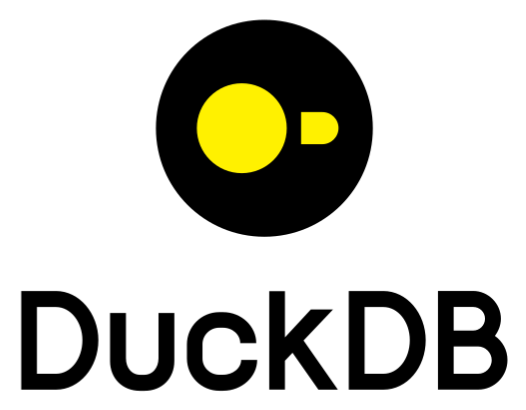

<div class="badges"><a href="https://github.com/umbralcalc/stochadex/releases"></a> <a href="https://github.com/umbralcalc/stochadex/actions/workflows/ci.yml"></a> <a href="https://codecov.io/gh/umbralcalc/stochadex"></a> <a href="https://github.com/umbralcalc/stochadex"></a> <a href="https://github.com/umbralcalc/stochadex/blob/main/LICENSE"></a> <a href="https://go.dev/"></a></div>
<div style="height:0.75em;"></div>

## So what is the 'stochadex' project?

It's a simulation engine written in [Go](https://go.dev/) which can be used to sample from, and learn computational models for, a whole 'Pokédex' of possible real-world systems **entirely in YAML**.

The framework abstracts away the machinery that sampling algorithms have in common behind a single configurable interface; so a whole simulation, the analysis and inference layered on top of it can be stated as pure configuration.

This simulation engine is designed based on the simulation software fundamentals described in [this collection of blog posts](https://umbralcalc.github.io/posts/simulating_real_world_systems_as_a_programmer_introduction.html).

## When to use it

The stochadex fits best when you want stochastic simulation, online inference and simulation-based decision-making over one composable primitive and you want a whole run to be a **single config file**.

The model, its wiring, the run mode, the data in/out and any inference or optimisation on top are **all data**: one YAML file, run by one prebuilt binary, with no Go toolchain anywhere in the loop. Maths outside the built-in catalogue can be written as expressions in the same file, so Go is only for genuinely new primitives.

Other declarative formats are narrower ([SBML](https://sbml.org/), [Modelica](https://modelica.org/)) or are languages with their own compilers ([Stan](https://mc-stan.org/), [GAML](https://gama-platform.org/)). However, you should probably reach for something else when:

- **Large fixed-shape, GPU, or autodiff-heavy Bayesian modelling** → [Stan](https://mc-stan.org/), [PyMC](https://www.pymc.io/), or Julia's [SciML](https://sciml.ai/).
- **Pure discrete-event simulation** (entities through queues and servers) → [godes](https://github.com/agoussia/godes) or [SimPy](https://gitlab.com/team-simpy/simpy/).
- **A standards-based interchange format** (systems biology, physical plant) → [SBML](https://sbml.org/) with [COPASI](https://copasi.org/), or [Modelica](https://modelica.org/).
- **Plain numerics or classical ML in Go** → [gonum](https://github.com/gonum/gonum), which the stochadex is built on.
- **Training neural networks or deep RL** → train in Python, then import a frozen ONNX/TorchScript model to run inference behind an [`Iteration`](http://stochadex.github.io/pkg/simulator.html#Iteration).

## Install

Three ways in, depending on whether you're writing YAML, letting an agent write it for you, or writing Go.

**As a CLI** → describe a whole run in one YAML file and execute it with a prebuilt binary. A config that names no Go anywhere runs in-process, so no Go toolchain is needed. See [running with configs](https://stochadex.github.io/pkg/configs.html).

```bash
curl -L "https://github.com/umbralcalc/stochadex/releases/latest/download/stochadex-$(uname -s | tr '[:upper:]' '[:lower:]')-$(uname -m | sed 's/x86_64/amd64/;s/aarch64/arm64/')" -o stochadex
chmod +x stochadex
```

**As a Claude Code plugin** → installs an authoring skill next to your agent, so you can describe a system in plain language and get a running, validated simulation. It drives the same CLI.

```bash
claude plugin marketplace add umbralcalc/stochadex
claude plugin install stochadex@stochadex
```

**As a Go library** → implement the `Iteration` interface to add a primitive the catalogue doesn't have, or embed the engine in your own service. Start with the [quickstart](https://stochadex.github.io/pkg/quickstart.html).

```bash
go get github.com/umbralcalc/stochadex
```

## Integrations

| Integration | What it does | Where |
|---|---|---|
| <br/> | Load state history into a simulation and write output back over `database/sql`. Point it at any Postgres-wire database. | [read](https://stochadex.github.io/pkg/analysis.html#NewStateTimeStorageFromPostgresDb) · [write](https://stochadex.github.io/pkg/analysis.html#NewPostgresDbOutputFunction) |
| <br/> | Build simulation output directly as Apache Arrow for columnar interchange (Polars / pandas / Parquet). Opt-in module. | [read](https://stochadex.github.io/pkg/arrowstore.html#ArrowStateTimeStorage.Record) · [write](https://stochadex.github.io/pkg/arrowstore.html#ArrowStateTimeStorageOutputFunction) |
| <br/> | Land the Arrow output in DuckDB for SQL analytics, zero-copy. Opt-in module. | [write](https://stochadex.github.io/pkg/duckdbstore.html#IngestToTable) |

## Projects using it

- [Event-based rugby match simulations to evaluate manager decision-making](https://github.com/umbralcalc/trywizard)
- [Fish ecosystem simulations using environment data to evaluate sustanability policies](https://github.com/umbralcalc/anglersim)
- [Antimicrobial resistance (AMR) stewardship simulations to evaluate hospital guidelines](https://github.com/umbralcalc/antimicrobial-resistance)
- [Stochastic simulations of catchment-scale flood dynamics under climate change](https://github.com/umbralcalc/floodrisk)
- [Energy storage dispatch simulation with demand response optimisation](https://github.com/umbralcalc/energy-balancer)
- [Planning approval policies for affordability with housing market simulations](https://github.com/umbralcalc/homark)
- [Small business survival and support policy simulation](https://github.com/umbralcalc/business-survival)
- [18xx gameplay design tool and Monte Carlo Tree Search (MCTS) agents](https://github.com/umbralcalc/18xxdesigner)
- [Turning simulations into in-browser interactive dashboards](https://github.com/umbralcalc/dexetera)
- [Inferring structural causal models from open source datasets](https://github.com/umbralcalc/openaction2outcome)
- [Seasonal bathing water pollution exceedance forecasts](https://github.com/umbralcalc/bathing-water-forecaster)

## Other cool engines

- [SimPy](https://gitlab.com/team-simpy/simpy/)
- [StoSpa](https://github.com/BartoszBartmanski/StoSpa)
- [FLAME GPU](https://github.com/FLAMEGPU/FLAMEGPU2/)
