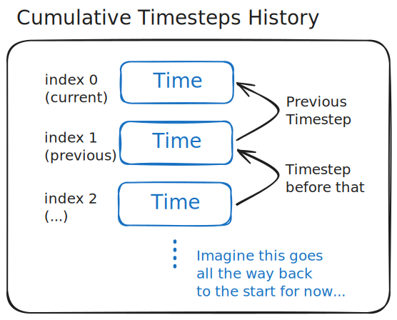
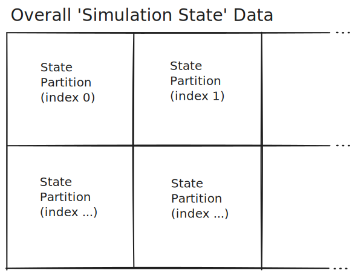
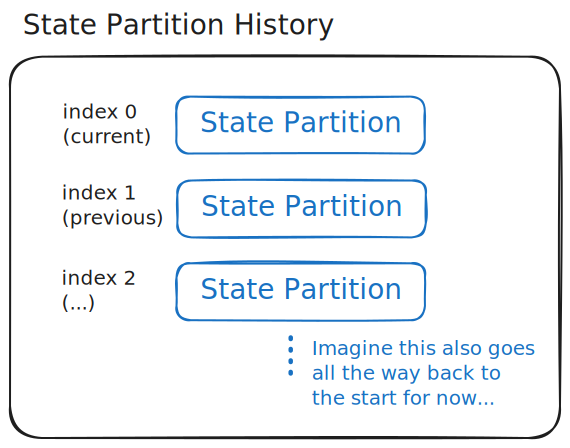
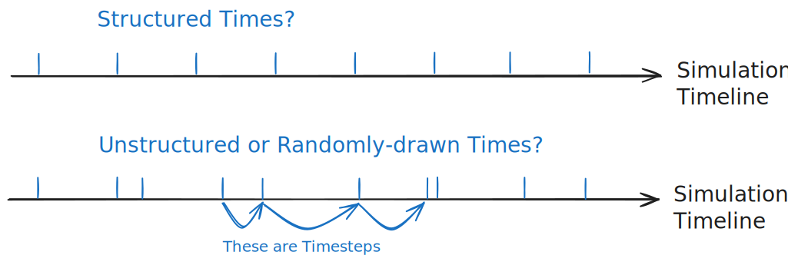
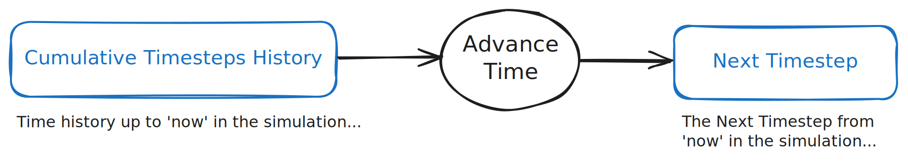
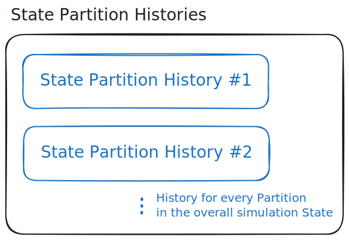
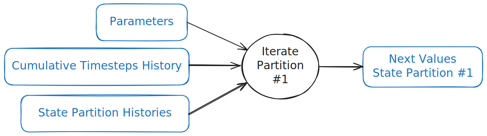
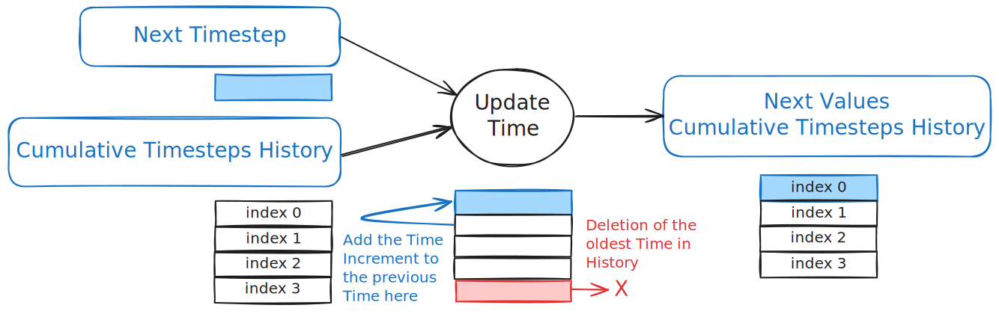
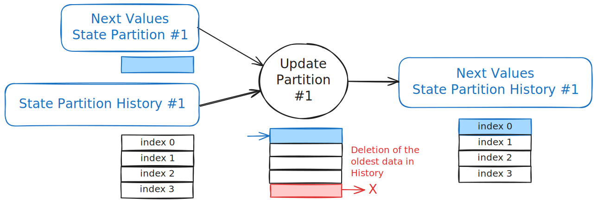

# The building blocks of simulations

## Time and its 'history'

Time is probably the most important variable to track in a simulation. This is because everything that happens within a simulation only has meaning with respect to the real world if we can trace what point in simulated Time that it happened.

Time is a variable in the simulation which always increases in value. We often want to track how it increases after each discrete simulation 'step' in increments which we shall call 'Timesteps'.

The first data structure which we shall introduce here is a 'Cumulative Timesteps History', which indexes simulated Times that the simulation _had_ according to _decreasing recency_.

## State partitions and their history

Simulations also have a 'State' associated to them for each value of Time.

A simulation State holds all of the essential information we want to track to make the simulation useful to us which, crucially, includes _all of the information that is needed for the simulation to proceed_.

In order to simplify how all of this State data is processed and retrieved, we're going to _partition_ this simulation State into several 'State Partition' data structures.

For example, one of these partitions might hold all the data associated to a player in a sports team, and the whole simulation needs all of the players within its overall State.

Each State Partition carries data that can be different for each moment in Time of the simulation. In order to track this evolution, we create a 'State Partition History' data structure for each State Partition.

Each State Partition History has indices which always match those of the Cumulative Timesteps History, so they are always synchronised with each other.

## Computing the next timesteps

So new States of the simulation may happen at different Times. But what determines when these Times are along the Simulation Timeline?

When simulating systems in the real world, it can be desireable in some situations to be able to structure the Times along the Timeline at regular intervals.

In other situations it can be desirable to have an unstructured or randomly-drawn set of Times along the Timeline.

In order to allow this flexibility in choice between situations, let's specify an 'Advance Time' calculation which takes in the current Cumulative Timesteps History and outputs the Next Timestep following the latest Time found in the History (at index 0).

## State partition iteration

For an overall simulation data view, we can create a 'State Partition Histories' structure. This is a collection of each State Partition History that exists within the simulation.

How do we determine the 'Next Values' of each State Partition in Time?

This is where we should maintain full flexibility in choice of calculation so that our simulation is able to represent many different real-world systems.

Each of these calculations for a given Partition specifies how the State Partition Histories and Cumulative Timesteps History data are used to determine the Next Values of the State Partition.

In order to support even more flexibility in configuration, the calculation should also take in a set of Parameters which are specific to that Partition.

## State partition and time updates

Having calculated the Next Values of each State Partition and the Next Timestep, we should perform operations over the Cumulative Timesteps History and each State Partition History to Update their structures with this new data.

This is an important procedure to perform all at once to ensure that the all of the State Partitions in the simulation are synchronised against its virtual clock.

## Composing two partitions

## Concurrent partition coordination

## Embedded simulations

## Parameters and configuration
