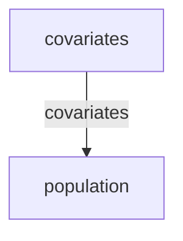

# Brown trout population dynamics — climate-forced stochastic Ricker

> **Methodology card.** This is the primary human- and agent-legible description of
> the model. The runnable stub beside it ([`stub.go`](stub.go)) is the type-checked
> generative demonstration; this card carries the structure, assumptions, and
> validity regime that the Go code does not spell out.

## System

Single-site brown trout (*Salmo trutta*) population dynamics in an English river,
as surveyed by Environment Agency electrofishing (the National Fish Population
Database). Fish density each year is governed by density-dependent recruitment and
by the physical state of the river — flow, water temperature, and dissolved oxygen.
The quantity of interest is the **trajectory of log-density** and how it responds
to a climate perturbation (warming) and to habitat / water-management levers.

The generative core is two coupled partitions:

| Partition | Iteration | State | Role |
|---|---|---|---|
| `covariates` | `ClimateCovariatesIteration` | `[flow_m3s, temperature_C, dissolved_oxygen_mgl]` | Mean-reverting environmental forcing + a temperature warming trend |
| `population` | `RickerIteration` | `[log_density]` | Stochastic Ricker density dependence with a linear covariate effect and an optional Allee term |

**Covariates.** Each of flow, temperature and dissolved oxygen is a mean-reverting
Gaussian process about its baseline level. Temperature additionally carries a
deterministic per-year warming drift (`warming_trend`), and its reversion is set to
zero so that drift accumulates into a linear warming trend rather than being pulled
back. Flow and dissolved oxygen are clipped at zero.

**Population (Ricker).** In log space,
`log(N_{t+1}) = log(N_t) + r0·allee + Σ βᵢcᵢ − α·N_t + N(0,σ²)`, where the
covariate term `Σ βᵢcᵢ` couples the population to the current environment
(`β_flow>0`, `β_temp<0`, `β_do>0` — warmer water hurts; more flow and oxygen help),
`α` is density-dependent mortality, and `allee = 1 − exp(−γN)` is a depensatory
multiplier that suppresses growth at low density when `γ>0` (γ=0 recovers the
standard Ricker). The covariate values are read within-step from the upstream
`covariates` partition via `params_from_upstream`.

<!-- BEGIN generated: partition-wiring (regenerate with `go run ./cmd/model-graphs`) -->

## Partition wiring

The partition dependency graph, derived statically from the stub's `BuildStub` wiring
by [`pkg/graph`](../../pkg/graph). Solid arrows are within-step `params_from_upstream`
wiring (which imposes a computation order); dashed arrows leaving a shaded past-copy
node are lag reads of a partition's committed state from an earlier step — drawn as
separate source nodes so the graph stays a DAG.

<!-- END generated: partition-wiring -->

## Ingests (in the stub: nothing)

The stub is **data-free** — every input is a literal constant in [`stub.go`](stub.go),
with the `warming_trend` exposed as the one swept driver. In the downstream
application the Ricker parameters are fitted from NFPD electrofishing density series
by simulation-based inference (SMC), and the covariate forcing is a bootstrap
resample from observed Environment Agency **hydrology** (river flow) and **water
quality** (temperature, dissolved oxygen) records — the model's real-world ingests
there. (The downstream repo documents that these covariates cover only a small
fraction of trout site-years; see its README.)

## Assumptions

- **Single site, annual step.** One well-mixed population; no spatial structure,
  no age/size structure (the downstream length data could add the latter).
- **Ricker density dependence** with a **linear, additive covariate effect** in log
  space — environment shifts the log-growth rate proportionally, with no interaction
  or nonlinearity between covariates.
- **Environmental covariates are exogenous** mean-reverting Gaussian processes,
  independent of the fish; climate change acts only through the temperature drift.
- **Warming enters solely through mean temperature**; within-year thermal extremes,
  flow–temperature coupling, and oxygen–temperature coupling are not represented.
- **Process noise is lognormal** (Gaussian in log-density); observation error is an
  inference concern and lives downstream, not in the generative stub.
- The stub's covariate process is a **generative stand-in** for the downstream
  data-bootstrap supply — it is not itself fitted to a gauge record.

## Validity regime

- Intended for **distributional, relative** questions ("which direction, and roughly
  how much, does density move under +X°C warming, or under a flow/oxygen change?"),
  not absolute density forecasting at a named site.
- Trustworthy for **sign and monotonicity** of parameter responses; absolute levels
  depend on calibration that lives downstream.
- A short spin-up is negligible because the population is initialised near its
  baseline equilibrium; the temperature random walk means longer horizons carry
  wider covariate (and hence density) spread — read ensembles, not single runs.
- Applies within the **linear-covariate regime**: extreme warming eventually drives
  the covariate term so negative that the Ricker equilibrium collapses, which is at
  the edge of where a linear log-growth response is credible.

## Failure modes

- **Uncalibrated parameters give plausible-looking but wrong magnitudes.** The
  structure guarantees only sign and monotonicity, not level.
- **Linear covariate response cannot represent thermal thresholds.** Real trout
  recruitment falls off sharply above species-specific temperatures; a constant
  `β_temp` under-states harm in a hot tail and over-states it in a cold one.
- **No absorbing extinction under the default (γ=0).** With positive environmental
  forcing the population rebounds from arbitrarily low density; genuine
  extinction/quasi-extinction requires the Allee term (γ>0) and is otherwise absent.
- **Exogenous covariates miss feedbacks** (e.g. low flow raising temperature and
  lowering oxygen together) that would compound climate stress in reality.

## Question answered

*Given a river's climate and water-quality regime — and a warming trend applied to
temperature — in which direction, and roughly how much, does brown trout density
move, and how does it respond to the flow and dissolved-oxygen levers a catchment
manager can influence?*

## Generative behaviour under test

[`stub_test.go`](stub_test.go) asserts, beyond "it runs":

1. **Harness** — no NaNs, correct state widths, no `params` mutation, no statefulness
   residue across a repeated run (`simulator.RunWithHarnesses`).
2. **Physical invariants** — flow ≥ 0 and dissolved oxygen ≥ 0 every step; all
   covariates and the log-density stay finite (no NaN / ±Inf divergence).
3. **Correct direction of parameter response** — raising the `warming_trend` lowers
   the ensemble-mean final log-density (the observed warming sweep is the first row
   of the generated **Observed behaviour** table below). A stub that merely "runs"
   would not catch an inverted climate response.

The **expected-behaviour suite** ([`behaviour_test.go`](behaviour_test.go)) adds
named, plain-language response claims, covering both kinds of lever. The observed
number for every claim is emitted by the test run and generated into the **Observed
behaviour** table below — never hand-typed, so it cannot drift from the code:

- **Decision-path (actionable habitat / water management).** Higher river flow
  (reduced abstraction) raises density; drought (lower flow) reduces it; a
  dissolved-oxygen improvement (pollution reduction) raises it. These map to the
  downstream scenario levers (abstraction / drought / water-quality).
- **Structural drivers (the world sets).** Warming reduces density (`β_temp<0`);
  higher intrinsic growth raises it; stronger density dependence lowers it; higher
  process noise widens the spread of outcomes; and the Allee effect (γ>0) slows
  recovery from low density relative to the standard Ricker — the mechanism behind a
  minimum viable population.

<!-- BEGIN generated: observed-behaviour (regenerate with `go run ./cmd/model-graphs`) -->

## Observed behaviour

Every row below is one *bound* object: a plain-language response claim, the test subtest that enforces it, and the number that test produced (ensemble values rounded to 2 dp). Nothing here is hand-written — the claims and their numbers are emitted by `TestAnglersimExpectedBehaviour` (via `go run ./cmd/model-graphs`), so a claim cannot drift from its test or its result. If the model's behaviour changes, either the binding test fails (a claim's assertion broke) or `TestCardsUpToDate` fails (a number moved) — a broken claim cannot reach the card silently.

| Response claim | Enforced by | Observed |
|---|---|---|
| Climate warming reduces density | [`TestAnglersimExpectedBehaviour/climate_warming_reduces_density`](behaviour_test.go) | ensemble-mean final log-density — +0.00 °C/yr -0.26 · +0.04 -0.34 · +0.08 -0.42 |
| Higher river flow (reduced abstraction) raises density | [`TestAnglersimExpectedBehaviour/reduced_abstraction_higher_flow_raises_density`](behaviour_test.go) | ensemble-mean final log-density — base flow -0.29 · flow ×2 -0.23 |
| Drought (lower flow) reduces density | [`TestAnglersimExpectedBehaviour/drought_lower_flow_reduces_density`](behaviour_test.go) | ensemble-mean final log-density — base flow -0.29 · flow ×0.25 -0.34 |
| Higher dissolved oxygen (pollution reduction) raises density | [`TestAnglersimExpectedBehaviour/water_quality_improvement_higher_dissolved_oxygen_raises_density`](behaviour_test.go) | ensemble-mean final log-density — base DO -0.29 · DO +3 mg/l -0.11 |
| Higher intrinsic growth rate raises density | [`TestAnglersimExpectedBehaviour/higher_growth_rate_raises_density`](behaviour_test.go) | ensemble-mean final log-density — base r0 -0.29 · r0=1.0 0.22 |
| Stronger density dependence reduces density | [`TestAnglersimExpectedBehaviour/stronger_density_dependence_reduces_density`](behaviour_test.go) | ensemble-mean final log-density — base α -0.29 · α=2.0 -0.98 |
| Higher process noise widens the outcome distribution | [`TestAnglersimExpectedBehaviour/higher_process_noise_widens_density_distribution`](behaviour_test.go) | ensemble std of final log-density — σ=0.05 0.08 · σ=0.6 0.60 |
| The Allee effect slows recovery from low density | [`TestAnglersimExpectedBehaviour/allee_effect_slows_recovery_from_low_density`](behaviour_test.go) | ensemble-mean final log-density from a low start — standard Ricker -2.00 · Allee γ=30 -5.75 |

<!-- END generated: observed-behaviour -->

## Bespoke extensions (staged beside the stub)

`RickerIteration` ([`ricker.go`](ricker.go)) is a custom `simulator.Iteration`
lifted **verbatim** from the downstream repo; the SMC / hierarchical parameter-fitting
helpers that accompany it there are inference concerns and were left downstream.
`ClimateCovariatesIteration` ([`covariates.go`](covariates.go)) is a data-free
generative stand-in authored for the stub, standing in for the downstream's
bootstrap-from-records covariate supply so the model runs with zero inputs.

These live here rather than in the engine core because the catalogue is the staging
ground for the "should this be promoted into core?" question — a generic
mean-reverting-covariate-forcing primitive, or a covariate-forced density-dependent
population step, recurring across other models would be the signal to promote, but
that waits for the recurrence.

## Downstream

Data ingestion (NFPD electrofishing series + EA hydrology / water quality),
covariate matching, simulation-based calibration and inference, and the projection /
scenario decision layer live in the project repo:

**[https://github.com/umbralcalc/anglersim](https://github.com/umbralcalc/anglersim)**
