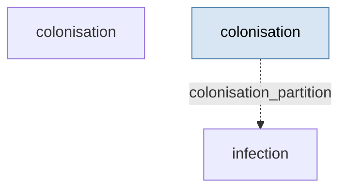

# Antimicrobial resistance in hospitals — two-strain colonisation → bloodstream infection

> **Methodology card.** This is the primary human- and agent-legible description of
> the model. The runnable stub beside it ([`stub.go`](stub.go)) is the type-checked
> generative demonstration; this card carries the structure, assumptions, and
> validity regime that the Go code does not spell out.

## System

The spread of antibiotic resistance through a hospital patient population, and the
resulting burden of resistant bloodstream infections (BSI). Concretely: two competing
strains of *E. coli* — cephalosporin-**susceptible** (S) and cephalosporin-**resistant**
(R) — colonising patients, where the hospital's aggregate cephalosporin **prescribing
rate** applies selective pressure that shifts the S/R balance. A downstream Poisson
process converts colonisation load into observed BSI counts.

The generative core is two coupled partitions:

| Partition | Iteration | State | Role |
|---|---|---|---|
| `colonisation` | `ColonisationDynamicsIteration` | `[S_frac, R_frac]` | Two-strain colonisation SDE (Euler–Maruyama) |
| `infection` | `InfectionProcessIteration` | `[S_bsi, R_bsi]` | Poisson BSI counts driven by colonisation |

The colonisation dynamics per unit time `dt`:

```
dS = [ turnover·(S_comm − S) + transmission·S·U − selection·ceph·S + fitness·R ] dt + noise·√S dW
dR = [ turnover·(R_comm − R) + transmission·R·U + selection·ceph·S − fitness·R ] dt + noise·√R dW
```

where `U = 1 − S − R` is the uncolonised fraction and `ceph` is the prescribing rate.
The **selection term** `selection·ceph·S` is the causal heart of the model: cephalosporin
use converts susceptible colonisation into resistant colonisation. BSI counts are
`Poisson(infection_probability · population · fraction · dt)` per strain.


<!-- BEGIN generated: partition-wiring (regenerate with `go run ./cmd/model-graphs`) -->

## Partition wiring

The partition dependency graph, derived statically from the stub's `BuildStub` wiring
by [`pkg/graph`](../../pkg/graph). Solid arrows are within-step `params_from_upstream`
wiring (which imposes a computation order); dashed arrows leaving a shaded past-copy
node are lag reads of a partition's committed state from an earlier step — drawn as
separate source nodes so the graph stays a DAG.



<!-- END generated: partition-wiring -->

## Ingests (in the stub: nothing)

The stub is **data-free** — every input is a literal constant in [`stub.go`](stub.go).
The single exogenous driver is the scalar `prescribing_rate`. In the downstream
application these constants become calibrated quantities and the prescribing rate is
produced by a policy partition rather than fixed; see **Downstream** below. The model's
real-world ingests there are UKHSA surveillance series (resistant BSI incidence) and
prescribing volumes.

## Assumptions

- **Mean-field, single ward/trust.** One well-mixed patient pool; no spatial or
  between-ward structure, no individual patient histories.
- **Two strains only.** Susceptible vs resistant to one drug class (cephalosporins);
  co-colonisation is not represented beyond the `S + R ≤ 1` constraint.
- **Colonisation fractions are a partition of the population** (`S, R ≥ 0`, `S + R ≤ 1`);
  the update clamps and renormalises to preserve this.
- **Selection is linear in prescribing rate and in S** — the simplest monotone form.
- **BSI is a rare, memoryless per-patient event** (Poisson), independent across strains
  given colonisation load.
- **Multiplicative demographic noise** (`√fraction`) so fluctuations scale with the
  colonised sub-population and vanish as it does.

## Validity regime

- Intended for **policy-scale, aggregate** questions ("does reducing cephalosporin
  prescribing lower the resistant BSI burden, and roughly how much?"), not
  patient-level prediction.
- Trustworthy while colonisation fractions sit **away from the 0/1 boundaries** and
  `dt` is small enough that the Euler–Maruyama step keeps `S + R` inside the simplex
  without the clamp doing heavy lifting. Near-saturation or large `dt` degrades it.
- Poisson BSI is appropriate while per-step expected counts are **modest**; the
  iteration switches to a normal approximation above λ = 30.

## Failure modes

- **Clamp masking.** If drift/noise repeatedly push `S + R > 1`, the renormalisation
  silently absorbs the error — the trajectory stays valid-looking while the dynamics
  are being distorted. Watch for frequent clamping as a sign parameters are out of regime.
- **Boundary noise.** The `√fraction` diffusion means a strain that reaches zero cannot
  re-seed from noise alone; extinction is absorbing absent community turnover.
- **Sign / magnitude of the selection term is unidentified by structure alone** — it must
  come from calibration. Getting it wrong inverts the model's central policy conclusion,
  which is exactly why the CI test asserts the *direction* of the prescribing response.
- **Aggregate mean-field** cannot capture outbreak/superspreading tails or heterogeneity
  in patient risk.

## Question answered

*Given a hospital's cephalosporin prescribing rate, what resistant colonisation fraction
and resistant bloodstream-infection burden does it sustain — and which direction, and
roughly how much, does changing that prescribing rate move them?*

## Generative behaviour under test

[`stub_test.go`](stub_test.go) asserts, beyond "it runs":
1. **Harness** — no NaNs, correct state widths, no `params` mutation, no statefulness
   residue across a repeated run (`simulator.RunWithHarnesses`).
2. **Structural invariants** — `S, R ∈ [0,1]`, `S + R ≤ 1` every step; BSI counts ≥ 0.
3. **Correct direction of parameter response** — raising `prescribing_rate` raises both
   the steady-state resistant colonisation fraction and the total resistant BSI burden.
   (Observed: resistant fraction 0.136 → 0.204 → 0.260 for prescribing 0.02 → 0.3 → 0.8.)

The **expected-behaviour suite** ([`behaviour_test.go`](behaviour_test.go)) adds named,
plain-language response claims:

- *Decision-path / mechanism (the actionable stewardship lever):* prescribing raises
  resistance **only through the selection term** — with `selection_coefficient` set to zero,
  a low-vs-high prescribing sweep leaves the resistant fraction unchanged, while with
  selection on the same sweep moves it. This pins down *why* the stewardship lever works.
- *Structural drivers (out-of-sample credibility):* a higher fitness cost lowers resistance;
  higher transmission raises total colonisation; a higher per-patient infection probability
  raises the resistant BSI burden (the colonisation → infection outcome path).

## Bespoke extensions (staged beside the stub)

`ColonisationDynamicsIteration` ([`colonisation.go`](colonisation.go)) and
`InfectionProcessIteration` ([`infection.go`](infection.go)) are custom
`simulator.Iteration` implementations, lifted verbatim from the downstream repo. They
live here rather than in the engine core because the catalogue is the staging ground for
the "should this be promoted into core?" question. A generic two-strain competition SDE
or a partition-driven Poisson-thinning process recurring across other models would be the
signal to promote — but that decision waits for the recurrence, not for this single case.

## Downstream

Data ingestion (UKHSA surveillance), simulation-based inference / calibration, and the
prescribing-policy decision layer (baseline / cycling / threshold / restriction) live in
the project repo:

**https://github.com/umbralcalc/antimicrobial-resistance**
