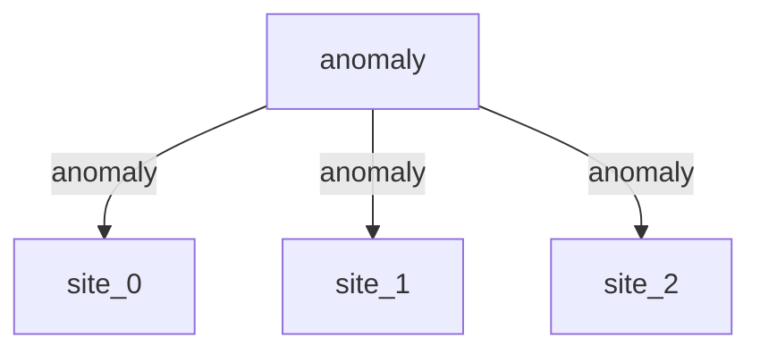

# Bathing-water exceedance risk — a shared regional anomaly coupling many sites

> **Methodology card.** This is the primary human- and agent-legible description of
> the model. The runnable stub beside it ([`stub.go`](stub.go)) is the type-checked
> generative demonstration; this card carries the structure, assumptions, and
> validity regime that the Go code does not spell out.

## System

Pollution-exceedance risk at England's ~451 designated bathing waters. For each
site the statutory question is whether the next routine in-season sample's *E. coli*
concentration will exceed the classification threshold. Each site's latent
log-concentration has a baseline, a day-of-year seasonal term, and — the mechanism
that distinguishes this project — a **shared regional "wet-week" anomaly** that
lifts the whole coastline's risk together when the weather turns wet. The quantity
of interest is the **exceedance probability**, and how coherently it moves across
sites.

The generative core is a shared driver coupled to many sites:

| Partition | Iteration | State | Role |
|---|---|---|---|
| `anomaly` | `continuous.OrnsteinUhlenbeckIteration` | `[z]` | Shared regional wet-week anomaly, mean-reverting with temporal persistence |
| `site_0…N` | `BathingConcentrationIteration` | `[mu, p_exceed]` | Per-site latent log-concentration → exceedance probability, all reading the same `z` |

**Anomaly.** One Ornstein–Uhlenbeck process `z(t)` mean-reverts to zero at speed
`theta` with volatility `sigma`. It carries temporal state — a wet week persists
across days — and is read same-step by every site.

**Concentration.** Each site's latent log-concentration is
`μ = baseline + A·sin(2π·t/period + φ) + λ·z(t)`, and its exceedance probability is
`Φ((μ − log_threshold) / σ)`, where `σ` is the within-site log-normal sample scale
(the individual-sample variability, integrated out analytically inside `Φ`, exactly
as in the downstream censored-log-normal likelihood). The **loading `λ`** is how
strongly the shared anomaly moves this site — set `λ` high for the whole coast and
sites move coherently; set it to zero and a site ignores the region entirely. The
step is deterministic given `z` and `t`; all cross-site-correlated randomness enters
through the shared anomaly.

<!-- BEGIN generated: partition-wiring (regenerate with `go run ./cmd/model-graphs`) -->

## Partition wiring

The partition dependency graph, derived statically from the stub's `BuildStub` wiring
by [`pkg/graph`](../../pkg/graph). Solid arrows are within-step `params_from_upstream`
wiring (which imposes a computation order); dashed arrows leaving a shaded past-copy
node are lag reads of a partition's committed state from an earlier step — drawn as
separate source nodes so the graph stays a DAG.

<!-- END generated: partition-wiring -->

## Ingests (in the stub: nothing)

The stub is **data-free** — every input is a literal constant in [`stub.go`](stub.go),
with the anomaly volatility exposed as the one swept driver. In the downstream
application the per-site baselines, seasonal coefficients, rainfall slope and sample
scale are fitted from Environment Agency bathing-water sample records (heavily
left-censored at the reporting limit) by censored maximum likelihood, partially
pooled across sites by empirical Bayes; the shared anomaly is *inferred* from
partly-censored observations by a sequential-Monte-Carlo particle filter. The
model's real-world ingests there are EA sample series and antecedent rainfall.

## Assumptions

- **Log-normal concentrations.** Counts are log-normal (the family the bathing-water
  classification itself uses); the exceedance probability is a normal-CDF tail.
- **Additive latent log-concentration.** Baseline, season and the shared anomaly add
  linearly in log space, with no interaction.
- **One shared anomaly per region.** A single scalar `z(t)` captures the common
  wet-week signal; each site loads on it linearly through `λ`. Genuinely local
  excursions beyond season and this shared term are not represented in the stub.
- **Sample scale is integrated out analytically**, not simulated per sample, so a
  site's step is deterministic given the anomaly — all stochasticity is the anomaly.
- **The dominant real-world covariate downstream is 2-day antecedent rainfall.** The
  stub folds shared wet-weather into the regional anomaly rather than replaying a
  per-site rainfall series (which is the data-driven, per-site-ceiling part); the
  anomaly is the project's actual out-of-sample contribution.

## Validity regime

- Intended for **distributional, relative** questions ("how does exceedance risk,
  and its coherence across sites, respond to wetter/more-variable weather, to
  coupling strength, or to a pollution-reduction or threshold change?"), not
  calibrated per-site nowcasting — that requires the downstream fit.
- Trustworthy for **sign and monotonicity** of parameter responses; absolute
  exceedance rates depend on the downstream calibration (the stub is tuned only to
  sit near the real ~2–3% base rate at low volatility).
- The anomaly starts at its stationary mean, so no spin-up is needed; but a single
  run is one weather trajectory — read ensembles, not single realisations.
- Applies in the **rare-exceedance regime** (site normally below threshold), where
  the convex tail response holds; a site sitting *at or above* the threshold would
  respond with the opposite sign to variance changes.

## Failure modes

- **Uncalibrated parameters give plausible-looking but wrong magnitudes.** The
  structure guarantees only sign and monotonicity, not level.
- **A single shared anomaly cannot represent multiple weather regimes** (e.g. a
  storm hitting one catchment but not the next); real coherence is spatially
  structured, and the scalar `z` over-couples distant sites.
- **The convex-tail response inverts above the threshold.** Claims like "more
  volatility raises exceedance" hold only for normally-clean sites; a chronically
  failing site (operating above threshold) moves the other way.
- **No censoring in the stub.** Censoring is first-class *downstream* (most counts
  are `< reporting limit`); the stub emits latent probabilities directly, so it
  cannot exhibit the calibration failure that ignoring censoring causes.

## Question answered

*Given a regional weather anomaly and a set of bathing sites with their own
baselines, seasons and coupling strengths, what exceedance probability does each
site carry — how coherently do the sites move together — and how does that risk
respond to weather variability, to pollution-reduction and threshold levers, and to
the strength of the shared regional signal?*

## Generative behaviour under test

[`stub_test.go`](stub_test.go) asserts, beyond "it runs":

1. **Harness** — no NaNs, correct state widths, no `params` mutation, no statefulness
   residue across a repeated run (`simulator.RunWithHarnesses`).
2. **Physical invariants** — the anomaly and every site's latent log-concentration
   stay finite; every site's `p_exceed` is a genuine probability in `[0,1]` at every
   step.
3. **Correct direction of parameter response** — raising the anomaly volatility
   raises the ensemble-mean exceedance probability at a below-threshold site.
   (Observed: mean P(exceed) 0.041 → 0.055 → 0.087 for anomaly volatility
   0.3 → 0.5 → 0.8, a 16-member ensemble over 400 steps.) A stub that merely "runs"
   would not catch an inverted response.

The **expected-behaviour suite** ([`behaviour_test.go`](behaviour_test.go)) adds
named, plain-language response claims, covering both kinds of lever:

- **Decision-path (actionable management / policy).** Pollution reduction (lowering a
  site's baseline) cuts its exceedance probability (observed for `site_1`:
  0.133 → 0.039 when the baseline count is roughly halved); a stricter statutory
  threshold raises the flagged exceedance probability. The forecast/advisory decision
  layer itself lives downstream.
- **Structural drivers (the world sets).** Higher regional anomaly volatility raises
  mean exceedance; **stronger regional coupling raises the cross-site correlation** of
  exceedance probabilities — the distinctive "one latent process driving a whole
  coastline" property (observed: correlation between two antiphase-season sites moves
  from −0.85 at near-zero coupling to +0.73 at strong coupling); faster anomaly
  mean-reversion lowers mean exceedance; a larger within-site sample scale raises it;
  and a larger seasonal amplitude raises the peak-season exceedance.

## Bespoke extensions (staged beside the stub)

`BathingConcentrationIteration` ([`concentration.go`](concentration.go)) is a custom
`simulator.Iteration` lifted from the downstream repo, where the same
latent-concentration → exceedance-probability step is an inline closure over a
`general.ValuesFunctionIteration` in the regional partition graph
(`internal/compose`); it is promoted here to a named iteration that computes its own
seasonal term so the stub self-drives. The shared anomaly reuses the engine's own
`continuous.OrnsteinUhlenbeckIteration`. The downstream data-fitting concerns —
censored maximum-likelihood fitting, empirical-Bayes pooling, and the particle
filter that infers the anomaly — are inference and were left downstream.

This iteration lives here rather than in the engine core because the catalogue is the
staging ground for the "should this be promoted into core?" question — a generic
"latent linear predictor → tail-exceedance probability" partition recurring across
other models would be the signal to promote, but that waits for the recurrence.

## Downstream

Data ingestion (EA bathing-water sample records + rainfall), censored-likelihood
fitting, empirical-Bayes pooling, the sequential-Monte-Carlo anomaly filter, and the
forecast-commitment / scoring decision layer live in the project repo:

**https://github.com/umbralcalc/bathing-water-forecaster**
