# GB grid balancing — residual-demand volatility driving battery dispatch under two policies

> **Methodology card.** This is the primary human- and agent-legible description of
> the model. The runnable stub beside it ([`stub.go`](stub.go)) is the type-checked
> generative demonstration; this card carries the structure, assumptions, and
> validity regime that the Go code does not spell out.

## System

The GB electricity system's short-run supply–demand balance, as seen by a grid-scale
battery energy storage system (BESS). **Residual demand** — national load net of
embedded wind and solar — is the quantity dispatchable plant and storage must meet. It
mean-reverts toward a conditional mean with Gaussian shocks. Two structural signals
respond to it: an **imbalance price** (linear in net load) and a **carbon intensity**
(also linear, since dirtier marginal plant runs at higher net load). Two identical
batteries then arbitrage the *same* market under two different threshold policies — one
price-driven, one carbon-driven — so their cycling, revenue and carbon savings can be
compared under identical conditions. The quantities of interest are **battery cycling**
(equivalent full cycles), **arbitrage revenue**, and **carbon saved**, and how they
respond as renewable penetration — and hence residual-demand volatility — rises.

The generative core is fifteen partitions: five shared signals and two symmetric
five-partition policy chains.

**Shared signals**

| Partition | Iteration | State | Role |
|---|---|---|---|
| `residual_demand` | `continuous.OrnsteinUhlenbeckExactGaussianIteration` | `[residual_mw]` | Mean-reverting net-load process (data-free stand-in for NESO replay) |
| `price_noise` | `continuous.OrnsteinUhlenbeckExactGaussianIteration` | `[noise_gbp]` | OU intra-period price noise (μ=0) |
| `carbon_noise` | `continuous.OrnsteinUhlenbeckExactGaussianIteration` | `[noise_gco2]` | OU carbon-intensity noise (μ=0) |
| `price` | `ImbalancePriceIteration` | `[price_gbp_per_mwh]` | `slope·residual + intercept + noise` |
| `carbon_intensity` | `CarbonIntensityIteration` | `[carbon_gco2_kwh]` | `slope·residual + intercept + noise` (co-moves with price) |

**Policy chain** (instantiated twice, with prefix `price_` and `carbon_`)

| Partition | Iteration | State | Role |
|---|---|---|---|
| `
_dispatch` | `PriceThresholdDispatchIteration` / `CarbonThresholdDispatchIteration` | `[dispatch_mw]` | Charge / discharge / hold at full power on the signal's thresholds |
| `
_battery` | `BatteryIteration` | `[soc_mwh, actual_dispatch_mw]` | SoC tracker with efficiency + SoC-limit back-calculation |
| `
_efc` | `BatteryDegradationIteration` | `[cumulative_efc]` | Running equivalent-full-cycle accumulator |
| `
_revenue` | `RevenueIteration` | `[cumulative_revenue_gbp]` | Running revenue against the price signal |
| `
_co2_saved` | `CarbonSavingsIteration` | `[cumulative_tco2]` | Running carbon displaced against the carbon signal |

**Residual demand.** An OU process is the natural choice: residual demand mean-reverts
toward its mean with a ~1.4 h half-life. Renewable penetration enters as the OU
volatility σ (`baseline + penetration·per_penetration`): more wind/solar → larger net-load
swings. This is the data-free replacement for replaying a NESO CSV — the same OU process
the downstream repo *infers* from data.

**Imbalance price and carbon intensity.** Both are structural linear responses to residual
demand plus mean-reverting noise. Coefficients are set so the baseline price (~£35/MWh)
sits between the charge (£25) / discharge (£45) thresholds and the baseline carbon
intensity (~175 gCO₂/kWh) sits between its charge (100) / discharge (250) thresholds, so
each battery earns only when volatility carries its signal across a threshold. Driving
both signals off the *same* residual-demand process reproduces their real co-movement — a
low-wind period simultaneously raises the price and the carbon intensity.

**Battery.** Dispatch is clipped to the power rating; SoC updates through one-way
charge/discharge efficiencies and is clamped to `[min_soc, max_soc]` with the actual
dispatch back-calculated when a limit binds. EFC, revenue and carbon saved accumulate from
the actual (post-constraint) dispatch. The two batteries are physically identical; only
their dispatch policy differs.

<!-- BEGIN generated: partition-wiring (regenerate with `go run ./cmd/model-graphs`) -->

## Partition wiring

The partition dependency graph, derived statically from the stub's `BuildStub` wiring
by [`pkg/graph`](../../pkg/graph). Solid arrows are within-step `params_from_upstream`
wiring (which imposes a computation order); dashed arrows leaving a shaded past-copy
node are lag reads of a partition's committed state from an earlier step — drawn as
separate source nodes so the graph stays a DAG.

```mermaid
flowchart TB
  n0["residual_demand"]
  n1["price_noise"]
  n2["carbon_noise"]
  n3["price"]
  n4["carbon_intensity"]
  n5["price_dispatch"]
  n6["price_battery"]
  n7["price_efc"]
  n8["price_revenue"]
  n9["price_co2_saved"]
  n10["carbon_dispatch"]
  n11["carbon_battery"]
  n12["carbon_efc"]
  n13["carbon_revenue"]
  n14["carbon_co2_saved"]
  n0past["residual_demand"]
  n1past["price_noise"]
  n2past["carbon_noise"]
  n3past["price"]
  n4past["carbon_intensity"]
  n6past["price_battery"]
  n11past["carbon_battery"]
  n0past -.->|demand_partition| n3
  n1past -.->|noise_partition| n3
  n0past -.->|demand_partition| n4
  n2past -.->|noise_partition| n4
  n3past -.->|price_partition| n5
  n5 -->|dispatch_mw| n6
  n6past -.->|battery_partition| n7
  n6past -.->|battery_partition| n8
  n3past -.->|price_partition| n8
  n6past -.->|battery_partition| n9
  n4past -.->|carbon_partition| n9
  n4past -.->|carbon_partition| n10
  n10 -->|dispatch_mw| n11
  n11past -.->|battery_partition| n12
  n11past -.->|battery_partition| n13
  n3past -.->|price_partition| n13
  n11past -.->|battery_partition| n14
  n4past -.->|carbon_partition| n14
  classDef pastcopy fill:#d8e6f3,stroke:#4a7ba6,color:#000;
  class n0past pastcopy;
  class n1past pastcopy;
  class n2past pastcopy;
  class n3past pastcopy;
  class n4past pastcopy;
  class n6past pastcopy;
  class n11past pastcopy;
```

<!-- END generated: partition-wiring -->

## Ingests (in the stub: nothing)

The stub is **data-free** — every input is a literal constant in [`stub.go`](stub.go),
with `renewablePenetration` exposed as the one swept driver. In the downstream application
the residual-demand OU parameters (θ, σ) are fitted from NESO half-hourly demand data by
OLS and SMC; the price and carbon models are calibrated against Elexon system prices and
Carbon Intensity API series, and the battery parameters against BESS engineering data. The
downstream real-world ingests are NESO demand, Carbon Intensity API, Sheffield Solar
PV_Live, and Elexon BMRS series. In particular, where the downstream *replays* a measured
carbon-intensity CSV, the stub *generates* carbon intensity structurally from residual
demand (see [`carbon.go`](carbon.go)) — replay is data ingestion and stays downstream.

## Assumptions

- **Residual demand is a scalar OU process** — a single mean-reverting net-load series with
  Gaussian shocks; no explicit weather, no diurnal/seasonal conditional mean (the
  downstream fits a time-varying μ by settlement period).
- **Renewable penetration acts purely through volatility.** Higher penetration raises the
  OU σ; it does not (in the stub) shift the mean or make the noise non-Gaussian, though in
  reality it does both.
- **Imbalance price and carbon intensity are each linear in residual demand plus additive
  OU noise** — structural reduced forms, not a market-clearing or dispatch-merit-order model.
  They co-move because they share the residual-demand driver; their independent noise terms
  are the only source of decoupling.
- **The dispatch policies are stateless full-power threshold rules** with no look-ahead, no
  forecast, and no optimisation. They are demonstration policies for comparison, not the
  downstream decision layer.
- **The two batteries do not interact.** Each sees the full market price/carbon signal; the
  stub does not model their joint effect on the market (no price impact), so it compares
  policies in isolation rather than simulating them competing.
- **Efficiency is a fixed one-way factor** each way; degradation is throughput-linear (EFC),
  independent of depth-of-discharge, temperature, or C-rate.
- **Half-hourly settlement periods**, constant Δ = 0.5 h.

## Validity regime

- Intended for **relative, distributional** questions ("how does battery cycling / arbitrage
  activity shift as intermittency rises?"), not absolute revenue forecasting or real
  dispatch scheduling.
- Trustworthy for the **direction and rough shape** of the volatility → cycling → revenue
  relationship; absolute £ and EFC magnitudes depend entirely on calibration.
- Because each signal's mean is pinned between its thresholds, each policy's activity is a
  clean function of that signal's volatility — the intended experimental surface.
- The carbon policy is deliberately **more selective** than the price policy (its thresholds
  bracket a wider band of the signal), so it cycles less at any given penetration — matching
  the downstream finding that a carbon-threshold battery participates in fewer settlement
  periods than a price-threshold one.
- A short spin-up is implicit (SoC starts at mid-capacity, the OU processes start at their
  means); over a one-week horizon the transient is minor for cumulative quantities.

## Failure modes

- **Uncalibrated parameters give plausible-looking but wrong magnitudes.** The structure
  guarantees sign and monotonicity, not level — absolute EFC and revenue are meaningless
  without calibration.
- **Volatility-only penetration understates the real 2030 shift.** Real high-renewable grids
  also *lower* mean residual demand and make the price distribution bimodal (wind-surplus vs
  wind-drought); the stub captures the volatility channel only.
- **A signal mean that drifts outside its thresholds breaks the experiment**: if
  `slope·mean + intercept` leaves the `[low, high]` band, that battery saturates at one rail
  and the volatility response collapses. The coefficients are chosen to avoid this for both
  signals.
- **Threshold dispatch is myopic** — it captures none of the value a forecast-aware or
  optimising policy would, so both policies under-report achievable value.
- **Price and carbon are near-perfectly correlated** in the stub (shared driver, modest
  independent noise), so the two policies dispatch similarly; the stub understates how
  differently they would behave against real, more weakly-coupled price and carbon series.

## Question answered

*As renewable penetration raises the volatility of residual demand, in which direction —
and roughly how much — does each policy's battery cycling (EFC) move, and how does a
price-threshold battery compare to a carbon-threshold one under identical market
conditions?*

## Generative behaviour under test

[`stub_test.go`](stub_test.go) asserts, beyond "it runs":
1. **Harness** — no NaNs, correct state widths, no `params` mutation, no statefulness
   residue across a repeated run (`simulator.RunWithHarnesses`).
2. **Physical invariants** (both policy chains) — state of charge stays inside
   `[min_soc, max_soc]` every step; actual dispatch never exceeds the power rating;
   cumulative EFC and cumulative CO₂ saved are non-negative and monotonically
   non-decreasing; carbon intensity stays non-negative.
3. **Correct direction of parameter response (both policies)** — raising
   `renewablePenetration` from 0.2 to 1.0 raises the ensemble-mean cumulative EFC for the
   price policy *and* the carbon policy. (Observed sweep for penetration
   0.0 → 0.2 → 0.5 → 0.7 → 1.0: price-policy EFC 0.03 → 0.52 → 2.47 → 3.54 → 4.93;
   carbon-policy EFC 0.00 → 0.05 → 0.82 → 1.73 → 3.37; price-policy revenue
   −£68 → £1.0k → £6.3k → £9.9k → £16.0k — the slight loss at zero volatility is round-trip
   efficiency with no arbitrage to capture; carbon-policy CO₂ saved
   0 → 3.9 → 40.7 → 84.1 → 155.4 tCO₂. The carbon policy cycles less than the price policy
   at every penetration, reproducing its greater selectivity.) Averaged over a 12-member
   ensemble so the claim is about the distribution, not one noisy realisation.

The **expected-behaviour suite** ([`behaviour_test.go`](behaviour_test.go)) makes the
decision-readiness explicit — each subtest is a named, plain-language response claim:

- *Decision-path responses (actionable levers a downstream controls):* a higher discharge
  threshold reduces price-policy cycling; a larger battery lowers its cycle count; a
  persistently expensive market drives the discharge action (battery ends drained, revenue
  positive); a persistently cheap market drives the charge action (battery ends full,
  revenue negative). The last two verify the sign of the `(state, action) → outcome` path
  directly — a wrong sign there is a wrong trade.
- *Structural-driver responses (non-actionable; out-of-sample credibility):* lower
  round-trip efficiency reduces revenue; higher price noise raises cycling; steeper price
  and carbon sensitivities raise their policies' cycling (with the intercept compensated to
  hold the mean in-band, avoiding the saturation failure mode below).

Authoring this suite surfaced a real aliasing bug in the stub — two policy chains had
shared a package-level params map, so a test overriding one chain's threshold leaked into
later runs. The fix (fresh per-call specs) is exactly the kind of defect the suite exists
to catch.

## Bespoke extensions (staged beside the stub)

`ImbalancePriceIteration` ([`imbalance_price.go`](imbalance_price.go)),
`PriceThresholdDispatchIteration` and `CarbonThresholdDispatchIteration`
([`dispatch.go`](dispatch.go)), `BatteryIteration` ([`battery.go`](battery.go)),
`BatteryDegradationIteration` ([`battery_degradation.go`](battery_degradation.go)),
`RevenueIteration` ([`revenue.go`](revenue.go)) and `CarbonSavingsIteration`
([`carbon_savings.go`](carbon_savings.go)) are custom `simulator.Iteration` implementations
lifted verbatim from the downstream repo's generative core.

`CarbonIntensityIteration` ([`carbon.go`](carbon.go)) is the one bespoke iteration written
*for* the catalogue rather than lifted: it is the data-free generative counterpart of the
downstream's data-replay `CarbonDataIteration`, mirroring `ImbalancePriceIteration`'s
structural form. The residual-demand and noise processes reuse the engine's own
`OrnsteinUhlenbeckExactGaussianIteration`, so no bespoke generator is needed there.

The data-fitting helpers that accompany these iterations downstream (OU parameter inference
by OLS/SMC, price/carbon calibration, and the carbon-intensity CSV replay) are inference /
ingestion concerns and were left downstream. These iterations live here rather than in
engine core because the catalogue is the staging ground for the "should this be promoted
into core?" question — a generic stock/SoC accumulator or a threshold-policy primitive
recurring across other models would be the signal to promote, but that waits for the
recurrence.

## Downstream

Data ingestion (NESO / Carbon Intensity API / Sheffield Solar / Elexon), OU parameter
inference (OLS + SMC), policy evaluation, and the dispatch decision layer live in the
project repo:

**https://github.com/umbralcalc/energy-balancer**
