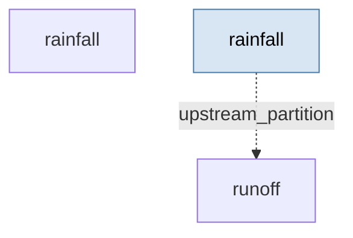

# Catchment flood risk — stochastic rainfall driving a rainfall-runoff cascade

> **Methodology card.** This is the primary human- and agent-legible description of
> the model. The runnable stub beside it ([`stub.go`](stub.go)) is the type-checked
> generative demonstration; this card carries the structure, assumptions, and
> validity regime that the Go code does not spell out.

## System

Catchment-scale flood dynamics under climate change, for the Upper Calder Valley
(West Yorkshire) — a catchment with a real flooding history (Boxing Day 2015). A
stochastic weather generator produces daily rainfall, which drives a lumped
conceptual hydrological model that converts rainfall into river flow. The quantity of
interest is the distribution of **peak flow** — the flood signal — and how it responds
to climate perturbation.

The generative core is two coupled partitions:

| Partition | Iteration | State | Role |
|---|---|---|---|
| `rainfall` | `StochasticRainfallIteration` | `[rainfall_mm]` | Two-state Markov (wet/dry) + Gamma wet-day amounts |
| `runoff` | `RainfallRunoffIteration` | `[soil_moisture_mm, total_flow, fast_flow, slow_flow]` | PDM nonlinear runoff + parallel fast/slow stores |

**Rainfall.** A first-order Markov chain switches between dry and wet days
(`p_wet_given_dry`, `p_wet_given_wet`); wet-day depth is a Gamma draw
(`wet_day_shape`, `wet_day_scale`). A `rainfall_multiplier` scales wet-day intensity —
the UKCP18-style climate-change knob (1.2 ≈ +20% intensity).

**Runoff (PDM-style).** Net rainfall (after evapotranspiration) partitions into direct
runoff and infiltration via a saturation-dependent runoff fraction
`1 − (1 − S/S_max)^b`; soil water above field capacity spills to runoff; slow drainage
feeds a baseflow store. Direct runoff and drainage route through parallel fast/slow
linear reservoirs (recession constants) and convert mm → m³/s by catchment area. The
**nonlinear saturation response** is the hydrological heart: a wet antecedent catchment
turns rainfall into flow far more efficiently than a dry one.

<!-- BEGIN generated: partition-wiring (regenerate with `go run ./cmd/model-graphs`) -->

## Partition wiring

The partition dependency graph, derived statically from the stub's `BuildStub` wiring
by [`pkg/graph`](../../pkg/graph). Solid arrows are within-step `params_from_upstream`
wiring (which imposes a computation order); dashed arrows leaving a shaded past-copy
node are lag reads of a partition's committed state from an earlier step — drawn as
separate source nodes so the graph stays a DAG.

<!-- END generated: partition-wiring -->

## Ingests (in the stub: nothing)

The stub is **data-free** — every input is a literal constant in [`stub.go`](stub.go),
with the `rainfall_multiplier` exposed as the one swept driver. In the downstream
application the rainfall parameters are fitted from gauge records and the runoff
parameters are calibrated against observed flow; the model's real-world ingests there
are Environment Agency rainfall and river-flow series.

## Assumptions

- **Lumped, single sub-catchment.** One well-mixed store; no spatial routing between
  sub-catchments (the downstream multi-catchment variant adds that).
- **Daily time step**, rainfall as the sole meteorological driver; ET is a constant rate,
  not energy-balance derived.
- **Rainfall occurrence is first-order Markov** and wet-day depths are iid Gamma,
  independent of season and of amount on adjacent days.
- **Runoff generation is a deterministic function of soil saturation** (PDM form); all
  stochasticity enters through the rainfall generator, not the hydrology.
- **Linear reservoir routing** for both fast and slow responses (constant recession).
- **Climate change acts multiplicatively on wet-day intensity** (and optionally on the
  transition probabilities); storm structure within a day is not represented.

## Validity regime

- Intended for **risk-scale, distributional** questions ("how does the peak-flow
  distribution shift under a +X% rainfall scenario?"), not deterministic event
  forecasting or precise inundation mapping.
- Trustworthy for **relative** comparisons (baseline vs perturbed, intervention vs none)
  more than absolute flow magnitudes, which depend on calibration.
- A spin-up window is required: the soil store starts at an arbitrary state, so early
  steps are transient and should be discarded (the CI test skips 60 days).
- Daily resolution misses **sub-daily flash-flood peaks**; the fast reservoir smooths the
  true hydrograph.

## Failure modes

- **Uncalibrated parameters give plausible-looking but wrong magnitudes.** The structure
  guarantees only sign and monotonicity, not level — absolute peak flow is meaningless
  without calibration.
- **Markov rainfall under-persists real storm sequences**, so multi-day accumulation (the
  actual driver of the worst floods) can be underestimated in the tail.
- **Field-capacity spill is a hard threshold**: near saturation the response becomes very
  sensitive to `field_capacity` and `runoff_shape`, and small parameter errors swing the
  peak sharply.
- **No spatial structure** means synchronous sub-catchment peaks (which drive the worst
  main-stem floods) are not captured by the single-catchment stub.

## Question answered

*Given a rainfall climate (occurrence, intensity, and a climate-change scaling factor),
what distribution of river peak flows does the catchment produce — and in which
direction, and roughly how much, does wetter forcing move the flood peak?*

## Generative behaviour under test

[`stub_test.go`](stub_test.go) asserts, beyond "it runs":
1. **Harness** — no NaNs, correct state widths, no `params` mutation, no statefulness
   residue across a repeated run (`simulator.RunWithHarnesses`).
2. **Physical invariants** — rainfall ≥ 0; flows ≥ 0; soil moisture stays inside the
   store `[0, field_capacity]`; total flow equals fast + slow every step.
3. **Correct direction of parameter response** — raising `rainfall_multiplier` from 1.0
   to 1.3 raises the ensemble-mean peak flow. (Observed: mean peak 39.9 → 48.9 → 58.0
   m³/s for multipliers 1.0 → 1.15 → 1.3.) Averaged over a 12-member ensemble so the
   claim is about the distribution, not one noisy realisation.

The **expected-behaviour suite** ([`behaviour_test.go`](behaviour_test.go)) adds named,
plain-language response claims. This model is **purely structural** — its decision layer
(natural flood management) lives entirely downstream, so the stub has no actionable in-stub
lever and the suite is instead comprehensive on the structural drivers of the flood peak:
higher wet-day persistence raises peak flow; higher evapotranspiration lowers it; a larger
catchment area raises it (the mm→m³/s scaling); and a greater soil-storage `field_capacity`
lowers it — the structural basis for why "make room for water" catchment measures work, and
the closest the stub comes to expressing the downstream NFM intervention.

## Bespoke extensions (staged beside the stub)

`StochasticRainfallIteration` ([`rainfall.go`](rainfall.go)) and
`RainfallRunoffIteration` ([`runoff.go`](runoff.go)) are custom `simulator.Iteration`
implementations lifted from the downstream repo. The parameter-fitting helpers that
accompany them there (estimating Gamma / Markov parameters and calibrating the PDM model
from observed series) are inference concerns and were left downstream. These iterations
live here rather than in the engine core because the catalogue is the staging ground for
the "should this be promoted into core?" question — a generic weather generator or a
linear-reservoir routing primitive recurring across other models would be the signal to
promote, but that waits for the recurrence.

## Downstream

Data ingestion (EA rainfall / flow series), calibration and simulation-based inference,
and the natural-flood-management intervention/decision layer live in the project repo:

**[https://github.com/umbralcalc/floodrisk](https://github.com/umbralcalc/floodrisk)**
