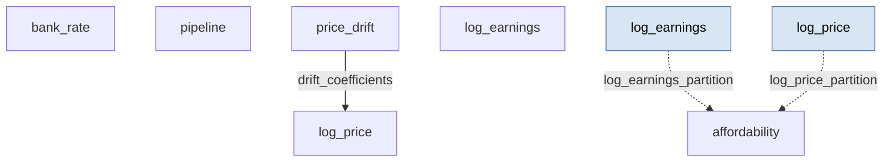

# Homark — single-LA UK housing affordability from supply, rates, incomes and demand

> **Methodology card.** This is the primary human- and agent-legible description of
> the model. The runnable stub beside it ([`stub.go`](stub.go)) is the type-checked
> generative demonstration; this card carries the structure, assumptions, and
> validity regime that the Go code does not spell out.

## System

A single UK local authority's monthly housing market. **Log price** and **log earnings**
each evolve as drift–diffusion SDEs; their ratio, `exp(logP − logE)`, is the
**price-to-earnings affordability index** (a lower value is better affordability). Price
growth is not free-floating: a reduced-form **log-price drift** couples it to three
observable forces — the **policy (bank) rate** (mortgage-cost channel), a stochastic
**planning-supply pipeline** (anticipated-supply channel), and, optionally, rising
**earnings** (demand channel). The pipeline is a per-unit stochastic stock: monthly
planning **approvals** flow in, and units **complete** or **lapse** by binomial draws each
month. The quantities of interest are the affordability index and the pipeline stock, and
how they respond to the levers a planning authority controls (approvals, market-facing
delivery) versus the forces the wider world sets (rates, incomes, demand pressure).

The generative core is six partitions:

| Partition | Iteration | State | Role |
|---|---|---|---|
| `bank_rate` | `continuous.OrnsteinUhlenbeckIteration` | `[rate_pct]` | Mean-reverting policy rate (data-free stand-in for BoE bank-rate replay) |
| `pipeline` | `StochasticPipelineIteration` | `[pipeline_stock]` | Planning-supply stock: approvals in, binomial completions + attrition out |
| `price_drift` | `general.ValuesFunctionIteration` | `[monthly_log_drift]` | Reduced-form drift: `base + bank_beta·(rate/100) − pipeline_beta·(mkt·stock/ref) + demand_beta·Δlog_earn` |
| `log_earnings` | `continuous.DriftDiffusionIteration` | `[log_earnings]` | Log earnings drift–diffusion |
| `log_price` | `continuous.DriftDiffusionIteration` | `[log_price]` | Log price drift–diffusion, drift wired from `price_drift` |
| `affordability` | `AffordabilityFromLogsIteration` | `[price_to_earnings]` | `exp(log_price − log_earnings)` |

**Wiring.** `price_drift` reads `bank_rate`, `pipeline` and `log_earnings` from the
previous step (lag-1 state-history reads); `log_price` reads `price_drift`'s current-step
output within the step (`params_from_upstream`), so the drift and the price it drives stay
aligned; `affordability` reads `log_price` and `log_earnings` by index. The supply channel
dampens on the pipeline **stock** (committed future supply visible to the market), not on a
delivered-completions flow — so it is the approval **inflow** that shifts long-run
affordability; completion speed changes the standing stock and delivery timing, not the
steady-state supply rate.

<!-- BEGIN generated: partition-wiring (regenerate with `go run ./cmd/model-graphs`) -->

## Partition wiring

The partition dependency graph, derived statically from the stub's `BuildStub` wiring
by [`pkg/graph`](../../pkg/graph). Solid arrows are within-step `params_from_upstream`
wiring (which imposes a computation order); dashed arrows leaving a shaded past-copy
node are lag reads of a partition's committed state from an earlier step — drawn as
separate source nodes so the graph stays a DAG.

<!-- END generated: partition-wiring -->

## Ingests (in the stub: nothing)

The stub is **data-free** — every input is a literal `Default*` constant in
[`stub.go`](stub.go), with `approvalRate` (planning approvals, units/month) exposed as the
one swept driver. In the downstream homark application the bank-rate path is replayed from
BoE data; log price and log earnings are calibrated per LA against UK HPI, ONS median pay
and the ONS affordability ratio; and the pipeline rates are informed by DLUHC net-additions
and permissions/completions series. Calibration is a deterministic grid over the drift
coefficients plus an Evolution Strategy (`theta_mean` / `theta_cov`). All of that — data
ingestion, per-LA calibration, holdout validation, and the policy-scenario grid — stays
downstream; only the generative iterations travel here.

## Assumptions

- **Log price and log earnings are drift–diffusion SDEs** — geometric Brownian growth with
  constant volatility; no regime switches, no fat tails, no explicit boom/bust cycle.
- **Price growth is a reduced-form linear drift** in the bank rate, the (market-scaled)
  pipeline stock, and the earnings deviation — a stylised behavioural reduced form, not a
  structural equilibrium of housing demand and supply.
- **The supply signal is the committed pipeline stock**, read as anticipated future supply.
  Higher approvals build a larger stock and dampen prices; because throughput equals inflow
  in steady state, *completion speed* changes the stock level and timing but not the
  long-run supply rate.
- **The bank rate is a scalar OU process** with a fixed long-run mean — no term structure,
  no explicit macro cycle, no pass-through lag to mortgage rates.
- **The demand coupling is off by default** (`demand_beta = 0`); when switched on it is a
  single linear term in log-earnings deviation from the initial level.
- **Monthly steps**, constant Δ = 1 month, single local authority — no commuter spillovers,
  no multi-market network, no tenure/MSOA disaggregation.

## Validity regime

- Intended for **relative, directional** questions ("which way, and roughly how much, does
  affordability move as approvals / rates / incomes change?"), not absolute price or
  affordability forecasting.
- Trustworthy for the **sign and rough shape** of each lever's response; absolute
  price-to-earnings levels depend entirely on per-LA calibration.
- The baseline coefficients hold the price-to-earnings ratio near a plausible ~8× and let
  the swept approval rate move it clearly across a decade; they are illustrative, not
  posteriors.
- Because the supply channel acts on anticipated stock, the model speaks to **planning
  approvals and market-facing delivery** as affordability levers; it deliberately does
  **not** claim that *building faster* (completion speed alone) changes long-run
  affordability.

## Failure modes

- **Uncalibrated coefficients give plausible-looking but wrong magnitudes.** The structure
  guarantees the sign of each response, not its level.
- **Strong demand coupling compounds.** The demand term grows with the earnings deviation,
  so a large `demand_beta` over a long horizon can drive price-to-earnings far above any
  realistic band — it is a directional device, not a calibrated elasticity.
- **The single-LA, single-market frame ignores spillovers** — no commuter belts, no
  cross-LA arbitrage, no national rate/price co-movement beyond the shared bank rate.
- **The reduced-form drift is not an equilibrium.** Push a coefficient hard and price growth
  can turn persistently negative or explosive with no market-clearing force to arrest it.
- **Volatility is constant and Gaussian**, so the model understates crash/boom skew and the
  clustering of housing-market turning points.

## Question answered

*For a single local authority, in which direction — and roughly how much — does the
price-to-earnings affordability index respond to the planning levers an authority controls
(approvals, market-facing delivery) and to the wider forces it does not (policy rates,
earnings growth, demand pressure)?*

## Generative behaviour under test

[`stub_test.go`](stub_test.go) asserts, beyond "it runs":
1. **Harness** — no NaNs, correct state widths, no `params` mutation, no statefulness
   residue across a repeated run (`simulator.RunWithHarnesses`).
2. **Physical invariants** — affordability and pipeline stock stay non-negative every step,
   and the pipeline stock never rises by more than the monthly approval inflow (completions
   and attrition only remove units — a conservation check on the bespoke pipeline).
3. **Correct direction of parameter response (headline)** — raising `approvalRate` from 40
   to 250 units/month lowers the ensemble-mean final price-to-earnings ratio (more
   market-facing committed supply → better affordability). Averaged over a 12-member seed
   ensemble so the claim is about the distribution, not one noisy realisation.

The **expected-behaviour suite** ([`behaviour_test.go`](behaviour_test.go)) makes the
decision-readiness explicit — each subtest is a named, plain-language response claim:

- *Decision-path responses (actionable planning levers):* more approvals improve
  affordability; a lower market-delivery fraction (tenure/affordable requirements diverting
  supply from the market) worsens it. These are the `(lever) → affordability` signs a
  downstream decision depends on — a wrong sign is a wrong recommendation.
- *Structural-driver responses (non-actionable; out-of-sample credibility):* a higher policy
  rate cools the market and lowers price-to-earnings; switching on demand pressure raises it;
  faster earnings growth improves affordability through the income denominator; and a faster
  pipeline completion rate lowers the mean pipeline stock (the throughput invariant of the
  bespoke iteration). Each covers a distinct mechanism — rate, demand, income, pipeline — so
  a sign error anywhere is caught.

The model's decision layer (the policy-scenario grids) lives downstream; the stub exposes
the underlying levers as swept params, so the actionable claims above are checked here while
the scenario tooling stays out of the engine.

## Bespoke extensions (staged beside the stub)

`StochasticPipelineIteration` ([`pipeline.go`](pipeline.go)) and
`AffordabilityFromLogsIteration` ([`affordability.go`](affordability.go)) are custom
`simulator.Iteration` implementations lifted **verbatim** from the downstream homark repo's
generative core (`pkg/housing`). The reduced-form price-drift body
([`price_drift.go`](price_drift.go)) is written *for* the catalogue rather than lifted: the
downstream function is entangled with the repo's `ForwardOptions` struct and spine data
types, so the data-free stub reproduces only its generative form, reading its coefficients
from params so behaviour tests can sweep them. The bank rate and the two log-level SDEs
reuse the engine's own `OrnsteinUhlenbeckIteration` and `DriftDiffusionIteration`, so no
bespoke generator is needed there.

The data-fitting helpers that accompany these iterations downstream (the deterministic
calibration grid, the Evolution Strategy sampler, the spine replay and credibility
diagnostics) are inference / ingestion concerns and were left downstream. These iterations
live here rather than in engine core because the catalogue is the staging ground for the
"should this be promoted into core?" question — a generic stochastic stock/pipeline
accumulator recurring across other models would be the signal to promote, but that waits for
the recurrence.

## Downstream

Data ingestion (UK HPI / BoE / ONS / DLUHC), per-LA calibration (deterministic grid +
Evolution Strategy), holdout validation, credibility diagnostics, and the policy-scenario
decision layer live in the project repo:

**[https://github.com/umbralcalc/homark](https://github.com/umbralcalc/homark)**
