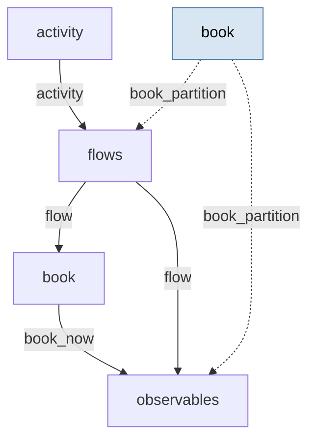

# Limit-order-book microsimulation — a shared activity driver → stochastic order flow → a matched book

> **Methodology card.** This is the primary human- and agent-legible description of the
> model. The runnable stub beside it ([`stub.go`](stub.go)) is the type-checked generative
> demonstration; this card carries the structure, assumptions, and validity regime the Go
> code does not spell out. Unusually for the catalogue, the *declarative* twin
> ([`declarative.yaml`](declarative.yaml)) is the form the downstream repo actually runs —
> see [Bespoke extensions](#bespoke-extensions).

## System

A single trading venue's limit order book, at the level of *counts* rather than individual
orders: how many lots rest at each of eight price levels on each side, how that resting depth
is churned by arrivals and cancellations, and how marketable orders eat into it. The quantity
of interest is the book's **stability** — the bid–ask spread, the resting depth, and above all
the sign and strength of the coupling between arrivals and depth, which is the market's
"self-stabilising brake." Every output is a counterfactual about market *state*; the model
makes no directional claim about price.

The whole book co-moves because a single latent **activity** process scales every flow: when
activity rises, arrivals, churn and cancellations all rise together. Arrivals are *damped* by
resting depth raised to an activity-dependent power — the one calibrated mechanism — so a deep
book suppresses the very arrivals that would deepen it further.

The generative core is four partitions:

| Partition | Iteration | State | Role |
|---|---|---|---|
| `activity` | `ActivityIteration` | `[activity]` | Shared latent AR(1) driver; one Gamma innovation per step |
| `flows` | `FlowsIteration` | `[arr_bid×8, arr_ask×8, can_bid×8, can_ask×8, buy, sell, clip]` | All stochastic order flow: depth-damped limit arrivals, quote churn, cancellations, one marketable order split buy/sell |
| `book` | `BookIteration` | `[bid×8, ask×8, swept]` | Deterministic matching engine: apply flows, walk each marketable order across levels |
| `observables` | `ObservablesIteration` | `[n_limit, n_cancel, n_market, depth_start, spread_ticks, clip_binds]` | Derived market summaries read off the book and flows |

**Two read mechanisms, both load-bearing.** `flows` reads the driver at the **current** step
(a within-step `params_from_upstream` edge) but the book's resting depth **one step back** (a
lag read of the book's committed state). The lag is the model, not an optimisation: arrivals
are damped by the depth that was resting when they were drawn, which makes `flows → book` the
*only* within-step edge and so keeps the dependency graph acyclic (no deadlock).
`observables` reaches `book` **both** ways at once — the post-update ladder (current) for the
spread, and the pre-update depth (lag) the arrivals responded to.

<!-- BEGIN generated: partition-wiring (regenerate with `go run ./cmd/model-graphs`) -->

## Partition wiring

The partition dependency graph, derived statically from the stub's `BuildStub` wiring
by [`pkg/graph`](../../pkg/graph). Solid arrows are within-step `params_from_upstream`
wiring (which imposes a computation order); dashed arrows leaving a shaded past-copy
node are lag reads of a partition's committed state from an earlier step — drawn as
separate source nodes so the graph stays a DAG.

<!-- END generated: partition-wiring -->

## Ingests (in the stub: nothing)

The stub is **data-free** — every input is a literal constant in [`stub.go`](stub.go), with
the arrival-damping exponent `damping_gamma` exposed as the one swept driver. In the downstream
application the model consumes a **live Binance BTC/USD depth-diff and trade feed**, from which
per-level arrival, cancellation and marketable counts are inferred; the damping exponent is
then fitted to the market's depth/arrival correlation and the rest of the flow parameters to
the pooled count correlations.

## Assumptions

- **Count-level, not order-level.** The book tracks lots resting at each level, not identified
  orders; queue position within a level is not represented (a separate downstream config adds
  it).
- **Eight price levels per side**, with a fixed tick; arrivals and churn thin geometrically
  with level depth (`exp(−decay·level)`).
- **A single shared activity driver** scales all flows, so the two sides and the three flow
  types co-move rather than being independent — this is the mechanism behind the pooled
  correlations the downstream targets.
- **Arrivals are damped by resting depth** as `rate / (1 + depth·(activity/act_ref)^γ/scale)`;
  everything stabilising in the model flows through this one term (and, when enabled, through
  depth-proportional cancellation).
- **The book is a deterministic function of the flows** — all randomness enters through the
  driver and the flow draws; matching (walking marketable orders across levels) adds none.
- **Marketable orders** arrive as a Poisson count split into buy/sell legs by a fair Bernoulli;
  a price-shock hook exists but is disabled by default.

## Validity regime

- Intended for **distributional / counterfactual** questions about market state — "how does the
  depth/arrival coupling, the spread, or the resting depth respond to X?" — not for forecasting
  price or the path of any single order.
- Trustworthy for **relative** comparisons (stronger vs weaker damping, heavier vs lighter
  marketable flow) and for the *sign and rough magnitude* of the correlation signatures, which
  is what it was built and calibrated to reproduce.
- A **spin-up window** is required: the book starts from an arbitrary ladder, so early steps are
  transient and are discarded (the tests skip 50 steps).
- Calibrated against **one venue over eight-minute windows**; the downstream record shows the
  co-movement signature replicates out of sample while the arrival–depth coupling does not, so
  the coupling's *level* is regime-dependent even where its sign is robust.

## Failure modes

- **Uncalibrated parameters give plausible but wrong magnitudes.** The structure guarantees the
  sign and monotonicity of each response, not its level; absolute depth, spread and correlation
  values depend on calibration.
- **The stabilising brake can hide by moving between flows.** Damping arrivals and cancelling
  resting depth are two brakes on the same instability; suppressing one can shift the
  correlation onto the other rather than removing it, so a single correlation read in isolation
  can mislead.
- **One-sided books report a sentinel spread.** When a side empties, `spread_ticks` jumps to the
  empty-book sentinel rather than a real number; averaging spread naively across such steps
  conflates "wide" with "absent."
- **Count-level, single-venue, short-window.** Queue dynamics, cross-venue flow and multi-day
  persistence are outside the model; the arrival–depth coupling in particular is the least
  transferable output.

## Question answered

*Given an order-flow regime (arrival, churn, cancellation and marketable-order intensities) and
an activity-dependent arrival-damping strength, what market state does the book settle into —
its resting depth, its spread, and in particular the sign and strength of the coupling between
resting depth and arrival flow, the market's self-stabilising brake?*

## Generative behaviour under test

[`stub_test.go`](stub_test.go) asserts, beyond "it runs":
1. **Harness** — no NaNs, correct state widths, no `params` mutation, no statefulness residue
   across a repeated run (`simulator.RunWithHarnesses`).
2. **Structural invariants** — every flow component non-negative; resting depth non-negative on
   every level; swept volume non-negative; the spread strictly positive and never above the
   one-sided sentinel; the cancellation-clip count within `[0, 2·levels]`.
3. **Correct direction of the headline response** — stronger activity-dependent damping (higher
   `damping_gamma`) drives the ensemble-mean correlation between resting depth and limit
   arrivals more negative. This is the model's reason to exist — the stability brake the
   downstream calibrates — and the assertion that would catch an inverted damping response.

The **expected-behaviour suite** ([`behaviour_test.go`](behaviour_test.go)) adds named,
plain-language response claims, each with the observed number emitted by the test run into the
**Observed behaviour** table below (never hand-typed). This model is **purely structural** — its
decision layer (order placement, execution and the calibration loop) lives entirely in the
downstream trading/inference application, so the stub has no in-stub actionable lever. The suite
is instead comprehensive on the structural drivers the world sets: the damping brake (headline),
limit-arrival intensity deepening the book, marketable-order rate thinning it and widening the
spread, marketable-order size sweeping more volume, and quote churn raising cancellations — one
claim per major mechanism.

<!-- BEGIN generated: observed-behaviour (regenerate with `go run ./cmd/model-graphs`) -->

## Observed behaviour

Every row below is one *bound* object: a plain-language response claim, the test subtest that enforces it, and the number that test produced (ensemble values rounded to 2 dp). Nothing here is hand-written — the claims and their numbers are emitted by `TestLimitOrderBookExpectedBehaviour` (via `go run ./cmd/model-graphs`), so a claim cannot drift from its test or its result. If the model's behaviour changes, either the binding test fails (a claim's assertion broke) or `TestCardsUpToDate` fails (a number moved) — a broken claim cannot reach the card silently.

| Response claim | Enforced by | Observed |
|---|---|---|
| Stronger activity-dependent damping drives the depth/arrival coupling more negative (headline driver) | [`TestLimitOrderBookExpectedBehaviour/stronger_damping_makes_the_depth_arrival_coupling_more_negative`](behaviour_test.go) | ensemble-mean corr(resting depth, limit arrivals) — γ=0.0 0.41 · γ=0.45 -0.18 · γ=0.9 -0.47 |
| Higher limit-arrival intensity deepens the resting book | [`TestLimitOrderBookExpectedBehaviour/higher_arrival_intensity_deepens_the_book`](behaviour_test.go) | ensemble-mean resting depth (lots) — limit_rate=2.0 77.32 · 3.381 231.73 · 5.0 453.41 |
| Heavier marketable-order flow thins the resting book | [`TestLimitOrderBookExpectedBehaviour/heavier_marketable_flow_thins_the_book`](behaviour_test.go) | ensemble-mean resting depth (lots) — market_rate=0.6 233.49 · 1.2 227.57 · 2.4 214.20 |
| Heavier marketable-order flow widens the bid–ask spread | [`TestLimitOrderBookExpectedBehaviour/heavier_marketable_flow_widens_the_spread`](behaviour_test.go) | ensemble-mean spread (ticks) — market_rate=0.6 2.04 · 1.2 2.18 · 2.4 2.63 |
| Faster quote churn raises the cancellation count | [`TestLimitOrderBookExpectedBehaviour/faster_quote_churn_raises_cancellations`](behaviour_test.go) | ensemble-mean cancellations per step (lots) — churn_rate=1.0 26.62 · 1.9 45.66 · 3.0 55.43 |
| Larger marketable orders sweep more volume from the book | [`TestLimitOrderBookExpectedBehaviour/larger_marketable_orders_sweep_more_volume`](behaviour_test.go) | ensemble-mean swept volume per step (lots) — market_size=2.0 2.45 · 4.0 4.67 · 8.0 9.41 |

<!-- END generated: observed-behaviour -->

## Bespoke extensions

There are **none staged for promotion**, and that is the finding. Every other catalogue entry
lifts custom `simulator.Iteration` code from its downstream repo; this one cannot, because the
downstream repo ([cryptobook](https://github.com/umbralcalc/cryptobook)) contains **no bespoke
Go at all** — its entire forward model is written as stochadex configuration and run by the
engine with no toolchain. So the relationship the catalogue usually has is inverted here:
[`declarative.yaml`](declarative.yaml) is (essentially) the config the downstream actually runs,
and the four Go iterations in this folder ([`activity.go`](activity.go), [`flows.go`](flows.go),
[`book.go`](book.go), [`observables.go`](observables.go)) are a faithful **re-expression** of it
in the SDK, kept identical to the data by the equivalence test.

That makes the promotion triage decidable *a priori* and in the affirmative: a serious,
market-calibrated model runs as pure data, so the engine is not missing a capability here
(a category-1 answer, established without needing recurrence). The bespoke Go is a convenience
form, nothing more — which is why the equivalence test can hold the two **bit-identical**
(~1e-12): the stochastic partitions draw from the same `rng.New(seed)` stream, in the same
order, that the expression evaluator does. This family of order-book configs is, separately, the
evidence that drove two engine primitives into core (`scan`, and a zero-width `slice`); see
[`models/CONVENTIONS.md`](../CONVENTIONS.md#category-2--capability-gap-the-dsl-cannot-express-it).

## Downstream

Data ingestion (a live Binance depth/trade recorder), calibration of the damping exponent to a
market correlation, simulation-based inference (SMC, likelihood surfaces), and the analysis that
turns the model into market-stability claims live in the project repo:

**[https://github.com/umbralcalc/cryptobook](https://github.com/umbralcalc/cryptobook)**
