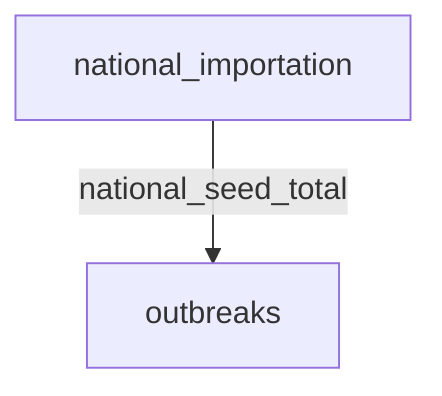

# Measles risk forecaster — susceptibility-driven local outbreaks under a shared national importation latent

> **Methodology card.** This is the primary human- and agent-legible description of
> the model. The runnable stub beside it ([`stub.go`](stub.go)) is the type-checked
> generative demonstration; this card carries the structure, assumptions, and
> validity regime that the Go code does not spell out.

## System

A sub-national measles transmission-risk surface over a set of local authorities
(UTLAs). Each area has an **effective susceptibility** `s`, derived from two-dose MMR
coverage, that sets its local reproduction number `R_local = R0·s`. A single
introduction into an area runs as a **stochastic SIR / susceptible-depleting
branching process**: offspring are negative-binomial (measles superspreading), and
the effective reproduction number declines as the local susceptible pool burns down,
so outbreaks either go extinct or self-limit at a community scale rather than growing
without bound. The areas are not independent: a **shared national importation latent**
(a seed total `M`, standing in for European measles activity) seeds every area at once
via `Poisson(M·receptivity_i)`, so when importation pressure is high, many areas surge
together. The quantities of interest are each area's case total, the national total,
and its over-dispersed joint tail — and how they respond to vaccine coverage,
transmissibility, and importation pressure.

The generative core is two partitions — a shared national latent and a joint
outbreak partition holding all areas in one wide state vector:

| Partition | Iteration | State | Role |
|---|---|---|---|
| `national_importation` | `NationalImportationIteration` | `[M]` | Shared national seed total, `M ~ logUniform(seed_low, seed_high)`, drawn once and held |
| `outbreaks` | `JointOutbreakIteration` | `[infectious_1..N, cumulative_1..N]` (width 2N) | Seeds each area `Poisson(M·receptivity_i)`, then branches every area one generation per step under susceptible depletion at its own `R_local = R0·s_i` |

**Wiring.** `outbreaks` reads the national total `M` within the step
(`params_from_upstream`), so at generation 0 the shared draw seeds every area
simultaneously; thereafter each area advances one branching generation per step,
reading its own previous state. Holding all areas in one partition (rather than one
partition per area) is what lets a single `M` couple them — this is the model's
genuinely multi-partition feature and the reason it can reproduce outbreak
co-occurrence that a per-area marginal model cannot.

**Susceptibility.** `s = 1 − (c2·e2 + (c1−c2)·e1)` from one- and two-dose MMR coverage
`c1, c2` and per-dose efficacies `e1, e2` — a cohort-free snapshot. The stub builds a
synthetic surface by spreading coverage around the swept central value so some areas
sit above and some below the ~95% herd-immunity threshold (`R_local = 1`).

**Susceptible depletion.** The reachable pool is `min(s·population·fraction,
reachable_cluster)`; capping it at a school/neighbourhood scale (~400) is what keeps
absolute outbreak sizes finite and community-scaled. `R_eff = R_local·remaining/pool`,
so an outbreak self-limits when its susceptibles run out.

<!-- BEGIN generated: partition-wiring (regenerate with `go run ./cmd/model-graphs`) -->

## Partition wiring

The partition dependency graph, derived statically from the stub's `BuildStub` wiring
by [`pkg/graph`](../../pkg/graph). Solid arrows are within-step `params_from_upstream`
wiring (which imposes a computation order); dashed arrows leaving a shaded past-copy
node are lag reads of a partition's committed state from an earlier step — drawn as
separate source nodes so the graph stays a DAG.

<!-- END generated: partition-wiring -->

## Ingests (in the stub: nothing)

The stub is **data-free** — every input is a literal `Default*` constant in
[`stub.go`](stub.go), with `mmr2Coverage` (central two-dose MMR coverage) exposed as
the one swept driver. In the downstream application the susceptibility surface is built
from **COVER** MMR coverage, CAR-smoothed over the real **ONS adjacency graph** so
sparse and disclosure-suppressed areas borrow strength from neighbours; the
reachable-cluster size and importation band are calibrated against observed UTLA
outbreak totals under a **censored likelihood** (UTLA counts below 10 are suppressed,
i.e. interval-censored `[0,9]`, not zero); `R0` carries its literature uncertainty
(~12–18); and a **reporting-lag nowcast** corrects the Region×week case series. All of
that — data ingestion, spatial smoothing, censored calibration, the nowcast, and the
risk-ranking / targeting decision layer — stays downstream; only the generative
iterations travel here.

## Assumptions

- **Susceptibility is a cohort-free coverage snapshot** — no waning, no natural
  immunity, no age-cohort accumulation (the downstream tests, and rejects, a cohort
  refinement).
- **A single introduction seeds a branching process** with negative-binomial offspring
  and susceptible depletion; the reachable pool is capped at a community scale, so
  absolute outbreak sizes are illustrative, not UTLA-wide totals.
- **Importation is one shared scalar latent** `M`, log-uniform over a wide band and
  held constant across a season's generations — a deliberately coarse importation-
  *pressure* index, not a weekly importation forecast.
- **Per-area receptivity is population share** — larger places receive proportionally
  more importations (flight-connectivity refinement is a documented downstream step).
- **Areas interact only through the shared `M`.** There is no geographic spread between
  areas within a season; co-occurrence comes from common importation pressure, not
  cross-border transmission.
- **`R0` is common across areas** and constant within a season; only `s` varies
  spatially.

## Validity regime

- Intended for **relative, distributional** questions ("which areas are primed, and how
  does the national case total and its joint tail respond to coverage / transmissibility
  / importation?"), not absolute case-count forecasting or outbreak timing.
- Trustworthy for the **sign and rough shape** of each response and for the *ordering* of
  areas by risk; absolute magnitudes depend on the downstream calibration (reachable
  cluster, importation band).
- The model forecasts **where is primed, not when it sparks** — it captures the
  predictable susceptibility half of spatial variance, not the irreducible importation
  randomness. The downstream backtest finds coverage is a near-sufficient spatial
  statistic and that no modelling robustly beats it; this stub is the honest generative
  core behind that finding, not a claim to beat the heuristic.
- The co-occurrence behaviour is qualitative: the shared latent over-disperses the
  national total, but the exact correlation depends on the calibrated seeding regime.

## Failure modes

- **Uncalibrated reachable-cluster and importation band give plausible-looking but wrong
  magnitudes.** The structure guarantees sign and monotonicity, not absolute case counts.
- **The homogeneous-mixing pool is an upper bound.** Real outbreaks are smaller
  (heterogeneity, clustering, public-health response), so absolute large sizes over-
  estimate; the cluster cap mitigates but does not calibrate this.
- **A single shared scalar `M` understates importation structure** — real importations
  cluster in specific communities (Orthodox Jewish, Traveller, vaccine-hesitant
  pockets), which area-average coverage and population-share receptivity do not capture.
- **Snapshot susceptibility misses the teen/young-adult cohorts** (the 1998–2004
  Wakefield-dip cohorts) that drove real 2024–25 cases but are invisible to current
  coverage data.
- **Superspreading interacts non-trivially with the cluster cap**: with a hard reachable
  ceiling, lowering the dispersion `k` does not cleanly fatten the final-size tail (the
  stub does not claim a monotone dispersion→tail response).

## Question answered

*Across local authorities, how does the simulated measles burden — each area's case
total, the national total, and its over-dispersed joint tail — respond to vaccine
coverage (the one actionable lever), and to the transmissibility and importation
pressure the world sets?*

## Generative behaviour under test

[`stub_test.go`](stub_test.go) asserts, beyond "it runs":
1. **Harness** — no NaNs, correct state widths, no `params` mutation, no statefulness
   residue across a repeated run (`simulator.RunWithHarnesses`).
2. **Physical invariants** — infectious and cumulative counts stay non-negative;
   cumulative cases are monotonically non-decreasing and never exceed the reachable
   susceptible pool (the susceptible-depletion cap); the shared national total `M` is
   drawn once, held constant across generations, and stays inside its band.
3. **Kernel vs theory** — a subcritical branching process seeded by one case has mean
   total progeny `1/(1−m)`, checked against the lifted `nextGeneration` kernel.
4. **Correct direction of parameter response (headline)** — lowering MMR coverage
   raises the ensemble-mean national case total (more areas cross `R_local = 1`; the
   observed coverage response is the first row of the generated **Observed behaviour**
   table below). Averaged over shared-importation scenarios so the claim is about the
   distribution, not one noisy realisation.

The **expected-behaviour suite** ([`behaviour_test.go`](behaviour_test.go)) makes the
decision-readiness explicit — each subtest is a named, plain-language response claim,
and the observed number for every claim is emitted by the test run into the **Observed
behaviour** table below (never hand-typed, so it cannot drift from the code). This model
is a transmission-*risk surface*: its one actionable lever is vaccine coverage; the rest
are structural drivers the world sets, and the targeting/ranking decision layer lives
downstream (so, like `floodrisk`, it is comprehensive on structural drivers rather than
in-stub actions):

- *Decision-path response (the actionable lever):* higher vaccine coverage reduces the
  national case total — a catch-up campaign pulls areas below the `R_local = 1`
  threshold. A wrong sign here is a wrong public-health recommendation.
- *Structural-driver responses (non-actionable; out-of-sample credibility):* higher-
  susceptibility areas accumulate more cases (the core causal gradient the surface rests
  on); a higher `R0` raises the national total; higher importation pressure raises it;
  and the shared national latent over-disperses the national total (its coefficient of
  variation far exceeds the fixed-importation baseline) — the joint-tail co-occurrence a
  per-area marginal model cannot produce. Each covers a distinct mechanism, so a sign
  error anywhere is caught.

<!-- BEGIN generated: observed-behaviour (regenerate with `go run ./cmd/model-graphs`) -->

## Observed behaviour

Every row below is one *bound* object: a plain-language response claim, the test subtest that enforces it, and the number that test produced (ensemble values rounded to 2 dp). Nothing here is hand-written — the claims and their numbers are emitted by `TestMeaslesExpectedBehaviour` (via `go run ./cmd/model-graphs`), so a claim cannot drift from its test or its result. If the model's behaviour changes, either the binding test fails (a claim's assertion broke) or `TestCardsUpToDate` fails (a number moved) — a broken claim cannot reach the card silently.

| Response claim | Enforced by | Observed |
|---|---|---|
| Higher vaccine coverage reduces total cases (the actionable lever) | [`TestMeaslesExpectedBehaviour/higher_vaccine_coverage_reduces_total_cases`](behaviour_test.go) | ensemble-mean national total cases — coverage 0.82 4224.33 · coverage 0.92 699.25 |
| Higher-susceptibility areas accumulate more cases | [`TestMeaslesExpectedBehaviour/higher_susceptibility_areas_accumulate_more_cases`](behaviour_test.go) | ensemble-mean cumulative cases per area — bottom third 14.24 · top third 180.92 |
| Higher basic reproduction number raises total cases | [`TestMeaslesExpectedBehaviour/higher_R0_raises_total_cases`](behaviour_test.go) | ensemble-mean national total cases — R0=12 1093.92 · R0=18 2613.33 |
| Higher importation pressure raises total cases | [`TestMeaslesExpectedBehaviour/higher_importation_pressure_raises_total_cases`](behaviour_test.go) | ensemble-mean national total cases — seed [10,30] 1013.17 · seed [100,300] 5070.50 |
| The shared national importation latent over-disperses the national total | [`TestMeaslesExpectedBehaviour/shared_national_latent_over_disperses_the_national_total`](behaviour_test.go) | coefficient of variation of the national total — fixed M 0.23 · shared latent 0.45 |

<!-- END generated: observed-behaviour -->

## Bespoke extensions (staged beside the stub)

`NationalImportationIteration` and `JointOutbreakIteration`
([`joint_simulation.go`](joint_simulation.go)) are custom `simulator.Iteration`
implementations lifted **verbatim** from the downstream repo's joint co-occurrence
simulation (`pkg/measles/joint_simulation.go`). The branching kernel `nextGeneration`
and the `SusceptibilityFromCoverage` map ([`transmission.go`](transmission.go)) are
lifted alongside them — the kernel is the shared O(1) Gamma–Poisson generation step
that the downstream's standalone per-UTLA `BranchingProcessIteration` also uses, so the
engine-native and unit-tested forms cannot drift apart.

The data-fitting machinery that accompanies these iterations downstream (the CAR
spatial smoother, the censored-Poisson likelihood and simulation-based calibration, the
importation-pressure index construction, and the reporting-lag nowcast) are inference /
ingestion concerns and were left downstream. These iterations live here rather than in
engine core because the catalogue is the staging ground for the "should this be promoted
into core?" question — a generic susceptible-depleting branching primitive, or a
shared-latent-couples-many-units pattern (which this shares in spirit with
`bathing-water-forecaster`), recurring across models would be the signal to promote, but
that waits for the recurrence.

## Downstream

Data ingestion (UKHSA / COVER / ONS), CAR spatial smoothing, censored-likelihood
calibration, the reporting-lag nowcast, the honest backtest against the coverage
heuristic, and the risk-ranking decision layer live in the project repo:

**[https://github.com/umbralcalc/measles-risk-forecaster](https://github.com/umbralcalc/measles-risk-forecaster)**
