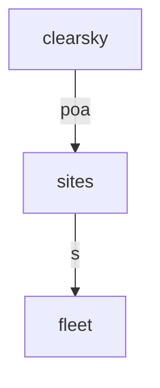

# Aggregate solar-PV fleet — deterministic solar geometry → a distance-coupled cloud field → fleet output

> **Methodology card.** This is the primary human- and agent-legible description of the
> model. The runnable stub beside it ([`stub.go`](stub.go)) is the type-checked generative
> demonstration; this card carries the structure, assumptions, and validity regime the Go
> code does not spell out. As with `limit-order-book`, the *declarative* twin
> ([`declarative.yaml`](declarative.yaml)) is the form the downstream repo actually runs —
> see [Bespoke extensions](#bespoke-extensions).

## System

A fleet of dispersed rooftop PV systems across a region, at the level of **aggregate output**:
how much the fleet generates, how variable that aggregate is, and how the variability responds
to geographic dispersion, cloud volatility and the fleet's physical configuration. Two things
distinguish it from the shared-latent family it otherwise resembles (`bathing-water-forecaster`,
`measles-risk-forecaster`): a **deterministic physical backbone** — solar geometry is known
physics, not a fitted term — and **distance-dependent coupling** derived from geography rather
than a scalar per-site loading.

Output at each site is the product of a deterministic clear-sky plane-of-array irradiance (from
solar position and panel orientation) and a stochastic **clear-sky index** `K` — the fraction of
clear-sky irradiance that actually arrives, which cloud cover suppresses. The whole fleet
co-moves because the sites' log-`K` processes share a **distance-decaying correlation**: nearby
sites see nearly the same cloud, distant sites decorrelate. This is the *full-covariance form*:
one wide partition draws a single innovation vector each step and correlates it with the Cholesky
factor of the fleet covariance, so the stationary correlation of log `K` equals the distance
kernel exactly. A single shared factor (correlation `~ λ_iλ_j`, distance-free) structurally
cannot produce the flagship dispersion-smoothing effect; this form can.

The generative core is three partitions:

| Partition | Iteration | State | Role |
|---|---|---|---|
| `clearsky` | `general.FromStorageIteration` | `[poa×4]` | Deterministic per-site clear-sky plane-of-array irradiance, precomputed from solar geometry and replayed by step number |
| `sites` | `FleetSkyIteration` | `[logK×4, gen×4]` | The full-covariance clear-sky-index field: one Cholesky-correlated innovation vector, an isotropic OU on log `K`, converted to per-site generation against the driver |
| `fleet` | `FleetAggregateIteration` | `[total]` | Aggregate fleet generation — the sum of site generation, a first-class state |

**Two read mechanisms, both load-bearing.** `sites` reads the clear-sky driver at the **current**
step (a within-step `params_from_upstream` edge from `clearsky`) and its own log-`K` vector **one
step back** (the lag-1 self read the wide-partition form uses to vectorise the OU update). `fleet`
reads the `sites` row at the current step. The only within-step edges are `clearsky → sites → fleet`,
so the dependency graph is acyclic (no deadlock) and the driver replay uses the engine's
`from_storage` iteration — the config-level series-replay path this fleet's downstream first
needed.

<!-- BEGIN generated: partition-wiring (regenerate with `go run ./cmd/model-graphs`) -->

## Partition wiring

The partition dependency graph, derived statically from the stub's `BuildStub` wiring
by [`pkg/graph`](../../pkg/graph). Solid arrows are within-step `params_from_upstream`
wiring (which imposes a computation order); dashed arrows leaving a shaded past-copy
node are lag reads of a partition's committed state from an earlier step — drawn as
separate source nodes so the graph stays a DAG.

<!-- END generated: partition-wiring -->

## Ingests (in the stub: nothing)

The stub is **data-free** — every input is a literal constant in [`stub.go`](stub.go) /
[`fleet.go`](fleet.go), with the per-site log-`K` innovation volatility (`cloud volatility`)
exposed as the one swept driver, and the clear-sky driver computed from a synthetic summer-day
time axis by the ported geometry ([`geometry.go`](geometry.go)). In the downstream application the
model consumes **Open Climate Fix `uk_pv` generation data**, from which per-site clear-sky indices
are inferred and the distance-decay coupling kernel and per-site OU parameters are calibrated.

## Assumptions

- **Solar geometry is exact, deterministic physics.** NOAA solar position, the Meinel clear-sky
  beam form, and a plane-of-array cosine-of-incidence transposition — no fitted terms, evaluated
  per site and step. The stochastic layer multiplies its output; it never perturbs it.
- **The clear-sky index is modelled on log `K`** as an isotropic Ornstein–Uhlenbeck process with a
  shared reversion speed and a shared innovation volatility, mean-reverting to a per-site
  stationary mean; `K` is soft-capped (systems can briefly exceed clear-sky).
- **Coupling is distance-decaying and geographic.** The stationary correlation of log `K` between
  two sites is `exp(−c₁·separation/cloud_speed)`, so the fleet covariance — and hence the Cholesky
  factor the innovation is correlated with — is fixed by the site positions, not fitted per pair.
- **Generation is `kwp · POA/I_stc · K · η`**, clipped non-negative — a nameplate-scaled linear
  response with a single derate `η`, no temperature or inverter-clipping term (those are the
  downstream's learned residual, deliberately out of the generative core).
- **The fleet aggregate is a plain sum** of site generation; capacity weighting enters through
  each site's `kwp`.

## Validity regime

- Intended for **distributional / counterfactual** questions about aggregate fleet output — "how
  does output *variability* respond to dispersion, cloud volatility, reversion speed, or panel
  configuration?" — not for forecasting a single site's output on a given day.
- Trustworthy for the **sign and monotonicity** of each response, and for *relative* comparisons
  (dispersed vs compact, volatile vs calm), which is what the structure guarantees.
- A **spin-up window** is required: log `K` starts at its stationary mean, so the first steps are
  transient and are discarded (the tests burn 100 steps).
- The illustrative fleet is four GB sites over a synthetic summer day; magnitudes are not
  calibrated. The downstream record shows the distance-decay *shape* replicates against real
  cross-site correlations (≈0.76 at 50 km, ≈0.20 at 300 km), but the kernel's fitted level is
  regime-dependent.

## Failure modes

- **Uncalibrated parameters give plausible but wrong magnitudes.** The structure fixes the sign
  and monotonicity of each response, not its level; absolute output, variability and correlation
  values depend on calibration against real data.
- **Level and efficiency are confounded.** Generation depends on `η·exp(μ)`, so a brighter panel
  and a higher clear-sky-index mean are indistinguishable from generation alone; only the product
  is identified. Reading either in isolation misleads.
- **The single-factor temptation is vacuous.** A shared scalar factor reproduces co-movement but
  not distance dependence, so the dispersion-smoothing claim would pass *without meaning* under it;
  it is non-vacuous here only because the full-covariance form makes coupling geographic.
- **Night and horizon-grazing sun.** Clear-sky POA is zero below the horizon and the beam-only
  Meinel form does not resolve refraction near sunrise/sunset, so sub-degree twilight output is not
  represented.

## Question answered

*Given a fleet of dispersed rooftop PV systems — their locations, orientations and capacities —
and a cloud regime (volatility, reversion speed, and a distance-decaying spatial correlation),
what aggregate output does the fleet produce and, above all, how variable is that aggregate, and
how does its variability respond to spreading the sites apart at fixed total capacity?*

## Generative behaviour under test

[`stub_test.go`](stub_test.go) asserts, beyond "it runs":
1. **Harness** — no NaNs, correct state widths, no `params` mutation, no statefulness residue
   across a repeated run (`simulator.RunWithHarnesses`).
2. **Structural invariants** — every site's generation non-negative and finite on every step, and
   the fleet aggregate exactly the sum of site generation.
3. **Correct direction of the headline response** — higher cloud volatility raises the variability
   of the aggregate fleet clear-sky index. This is the driver the model exposes, and the assertion
   that would catch an inverted volatility response.

The **expected-behaviour suite** ([`behaviour_test.go`](behaviour_test.go)) adds named,
plain-language response claims, each with the observed number emitted by the test run into the
**Observed behaviour** table below (never hand-typed). This model is **purely structural** — its
decision layer (capacity siting under output-variability risk, and the calibration loop) lives
entirely in the downstream application, so the stub has no in-stub actionable lever. The suite is
instead comprehensive on the structural drivers the world sets: cloud volatility and mean-reversion
speed acting on aggregate variability, the flagship geographic-dispersion effect, and the three
deterministic geometry drivers — tilt, orientation and latitude — acting on output shares.

<!-- BEGIN generated: observed-behaviour (regenerate with `go run ./cmd/model-graphs`) -->

## Observed behaviour

Every row below is one *bound* object: a plain-language response claim, the test subtest that enforces it, and the number that test produced (ensemble values rounded to 2 dp). Nothing here is hand-written — the claims and their numbers are emitted by `TestSolarFleetExpectedBehaviour` (via `go run ./cmd/model-graphs`), so a claim cannot drift from its test or its result. If the model's behaviour changes, either the binding test fails (a claim's assertion broke) or `TestCardsUpToDate` fails (a number moved) — a broken claim cannot reach the card silently.

| Response claim | Enforced by | Observed |
|---|---|---|
| Higher sky volatility raises the variability of aggregate fleet output | [`TestSolarFleetExpectedBehaviour/higher_cloud_volatility_raises_fleet_variability`](behaviour_test.go) | std of aggregate clear-sky index — sigma 0.5 0.20 · sigma 1.0 0.25 |
| Spreading sites apart lowers aggregate output variability at fixed capacity | [`TestSolarFleetExpectedBehaviour/wider_geographic_dispersion_lowers_fleet_variability`](behaviour_test.go) | std of aggregate clear-sky index — compact fleet 0.40 · dispersed fleet 0.25 |
| Faster mean-reversion of the cloud field lowers output variability | [`TestSolarFleetExpectedBehaviour/faster_cloud_reversion_lowers_output_variability`](behaviour_test.go) | std of aggregate clear-sky index — theta 0.15 0.26 · theta 0.6 0.22 |
| Increasing panel tilt raises the winter-season output share | [`TestSolarFleetExpectedBehaviour/steeper_tilt_shifts_output_toward_winter`](behaviour_test.go) | winter output share — tilt 20 0.16 · tilt 50 0.28 |
| Orientation closer to due south raises annual output | [`TestSolarFleetExpectedBehaviour/southward_orientation_raises_annual_output`](behaviour_test.go) | annual clear-sky POA proxy — azimuth 120 101009.17 · azimuth 180 119776.95 |
| Higher latitude widens the summer/winter output ratio | [`TestSolarFleetExpectedBehaviour/higher_latitude_widens_summer_winter_ratio`](behaviour_test.go) | summer/winter output ratio — latitude 45 2.28 · latitude 60 11.96 |

<!-- END generated: observed-behaviour -->

## Bespoke extensions

Like `limit-order-book`, this entry **inverts the usual stub↔twin relationship**, and that is the
finding. The downstream repo ([solar-fleet](https://github.com/umbralcalc/solar-fleet)) contains
**no bespoke Go** — its entire forward model is stochadex configuration written from Python and run
by the engine — so [`declarative.yaml`](declarative.yaml) is (essentially) the config the
downstream actually runs, and the bespoke iterations here ([`fleetsky.go`](fleetsky.go),
[`aggregate.go`](aggregate.go)) are a faithful **re-expression** of it, kept exact by the
equivalence test. The deterministic backbone ([`geometry.go`](geometry.go), [`fleet.go`](fleet.go))
ports the solar physics and the Cholesky coupling; it is pure, data-free, and staged here beside
the stub.

That makes the promotion triage decidable *a priori* and in the affirmative: a distance-coupled
multivariate fleet model runs as pure data, so the engine is **not** missing a capability here
(a category-1 answer, no recurrence needed). Two mechanisms make the twin possible and are worth
naming, because both were driven into the engine by *this* fleet's downstream:

- **`from_storage`** — the config-level replay of a precomputed external series into a live
  simulation partition, which the `clearsky` driver uses. Before it, a deterministic driver could
  reach a partition only from Go.
- **Correlated multivariate innovations in the DSL** — drawing the whole innovation vector once
  (`iid(4, normal(0,1))`) and correlating it with a constant Cholesky factor
  (`each(4, i, dot(slice(lflat, i*4, 4), xi))`) needs no per-lane draw control, refuting the
  design plan's prediction that the full-covariance form would be a capability gap.

The bespoke Go is a convenience form, nothing more — which is why the equivalence test holds the
two exact (~1e-12): the `sites` partition draws its innovation from the same `rng.New(seed)` stream,
in the same order, that the expression evaluator does. See
[`models/CONVENTIONS.md`](../CONVENTIONS.md#category-1--standardisation-candidate-the-dsl-can-express-it).

## Downstream

Data ingestion (OCF `uk_pv` Parquet), calibration of the OU parameters and the distance-decay
kernel against real cross-site correlations, a bootstrap particle filter with ESS for the latent
clear-sky index, a learned ONNX generation residual, and the capacity-siting decision layer that
turns dispersion-smoothing into an allocation all live in the project repo:

**[https://github.com/umbralcalc/solar-fleet](https://github.com/umbralcalc/solar-fleet)**
